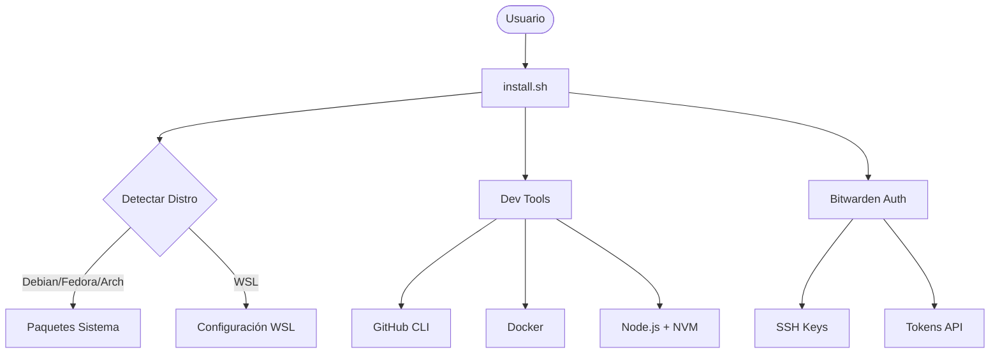

# 🚀 Dotfiles

> **Sincronización Total** — Entorno de desarrollo unificado y automatizado para Linux (Ubuntu, Fedora, Arch, WSL).

<!-- BADGES: Usa style=flat-square -->
[](https://www.gnu.org/software/bash/)
[](https://www.linux.org/)
[](LICENSE)

<p align="center">
  
  <!-- TODO: Asegurar que exista una imagen o gif de demo aquí -->
</p>

---

## ✨ Características

| Característica              | Descripción                                                                          |
| :-------------------------- | :----------------------------------------------------------------------------------- |
| 🔹 **Sistema Base**          | Configuración esencial optimizada (`vim`, `tmux`, `fzf`, `ranger`).                  |
| 🔸 **Dev Suite**             | Toolkit completo con Docker, GitHub CLI (`gh`), Node.js (nvm) y utilidades modernas. |
| 🔐 **Seguridad Zero-Config** | Gestión de secretos con `.env.age`, `age` y autenticación Bitwarden automática.      |
| 🤖 **Antigravity AI**        | Protocolos `GEMINI.md` y workflows inteligentes para desarrollo asistido.            |
| ☁️ **Cloud Tools**           | Configuración automática de `rclone` (Google Drive) desde secretos encriptados.      |
| 🖥️ **Soporte WSL**           | Integración nativa con Windows, incluyendo copiado automático de llaves SSH.         |

---

## � Inicio Rápido

### Requisitos
- Distribución Linux basada en Debian, Fedora o Arch.
- Conexión a Internet.
- Cuenta de Bitwarden (opcional, para automatización completa).

### 1. Clonar el repositorio
```bash
git clone https://github.com/herwingx/dotfiles.git ~/dotfiles
cd ~/dotfiles
```

### 2. Ejecutar Instalador
El script es interactivo y detectará tu distribución automáticamente.

```bash
chmod +x install.sh
./install.sh
```

### 3. Seleccionar Opción
Verás un menú interactivo. Para una instalación completa seleccione la opción **1**.

```text
INSTALACIÓN COMPLETA
 1) Instalar TODO (sistema + dev tools + antigravity)
```

---

## 🏗️ Arquitectura



## 🧠 Filosofía de Desarrollo

Nuestras decisiones técnicas no son arbitrarias; buscan **estabilidad, reversibilidad y velocidad**.

### 1. ¿Por qué Squash & Merge?
En lugar de ensuciar `main` con commits intermedios ("wip", "fix typo", "casi listo"), usamos **Squash**.
- **Beneficio**: Cada commit en `main` es una **funcionalidad completa y verificada**.
- **Reversibilidad**: Si una feature rompe producción, revertirla toma **un solo comando** (`git revert COMMIT_ID`), en lugar de buscar y revertir 15 commits dispersos.

### 2. Protección Absoluta de Main
`main` es la **única fuente de verdad**.
- **Regla**: Nadie (ni humanos ni bots) hace commit directo a `main`.
- **Razón**: Garantiza que todo cambio pase por Pull Request, CI/CD y revisión de calidad.

### 3. Automatización con GitHub CLI (`gh`)
Reducimos la fricción de contexto.
- **Flujo**: Todo el ciclo (Crear Repo ➔ PR ➔ Merge ➔ Release) se hace desde la terminal.
- **Estandarización**: Evita errores humanos al configurar repositorios o merges manuales.

---

## 📦 Opciones de Despliegue

| Método           | Comando    | Ideal para                      |
| :--------------- | :--------- | :------------------------------ |
| Full Install     | `Option 1` | Máquina nueva de desarrollo     |
| Minimal          | `Option 2` | Servidores o entornos ligeros   |
| Antigravity Only | `Option 4` | Solo reglas y workflows para IA |

📘 Ver detalles de instalación: [install.sh](install.sh)

## � Gestión de Secretos (.env.age)

Este repositorio utiliza **Age** para proteger variables sensibles (Tokens de GitHub, Credenciales Rclone).

**Script de Gestión:** `scripts/manage_secrets.sh`

```bash
./scripts/manage_secrets.sh
# Opción 1: Editar (Desencripta -> Abre nano -> Encripta al guardar)
# Opción 2: Ver (Muestra el contenido desencriptado)
```

> **Nota:** Al instalar, el sistema configuración automáticamente `rclone` a partir de estos secretos.

## �🔧 Comandos Útiles (Aliases)

Este dotfiles incluye `lsd` y aliases modernos para productividad.

```bash
# Navegación y Listado
lsd        # Reemplazo moderno de ls
ll         # Listado detallado (lsd -la)
lt         # Árbol de directorios (lsd --tree)

# Git (Workflow Optimizado)
gs         # git status
ga .       # git add .
gc "msg"   # git commit -m "msg"
gp         # git push
gl         # git pull --rebase
undo       # Deshacer último commit manteniendo cambios

# Docker
d          # docker
dc up -d   # docker compose up -d
dlog       # docker logs -f
```

## 📚 Documentación

| Documento                      | Descripción                                             |
| :----------------------------- | :------------------------------------------------------ |
| [GEMINI.md](GEMINI.md)         | **Protocolo Antigravity**: Reglas para el asistente IA. |
| [Workflows](global_workflows/) | Flujos automatizados (`/commit`, `/release`, etc.).     |

## 🛠️ Stack Tecnológico

**Core**
- [Bash]: Scripting y automatización.
- [Bitwarden CLI]: Gestión de credenciales.
- [Age]: Encriptación de secretos (`.env.age`).
- [Rclone]: Sincronización de almacenamiento en la nube.

**Herramientas**
- [Git]: Versionado con configuración avanzada.
- [Docker]: Contenedorización.
- [Tmux]: Multiplexor de terminal.
- [Neovim/Vim]: Edición de texto.

## � Seguridad
- ✅ **Sin secretos en código**: Todo se extrae en runtime desde Bitwarden.
- ✅ **SSH Keys seguras**: Importación automática sin exponer archivos.
- ✅ **Commits firmados**: Configuración lista para GPG/SSH signing.

## 🤝 Contribuir
1. Fork del repositorio
2. Crear rama: `git checkout -b feat/nueva-feature`
3. Commit: `git commit -m "feat: descripción"`
4. Push: `git push origin feat/nueva-feature`
5. Crear Pull Request

## 📄 Licencia
Este proyecto está bajo la licencia MIT. Ver [LICENSE](LICENSE) para más detalles.

---
<p align="center">
  Made with ❤️ by <b>herwingx</b>
</p>
