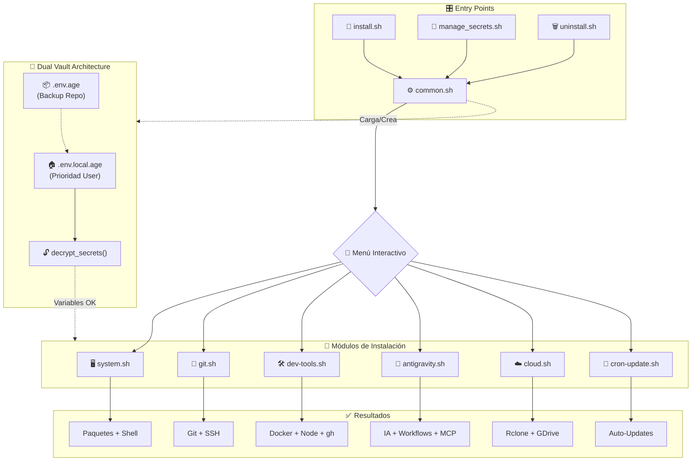
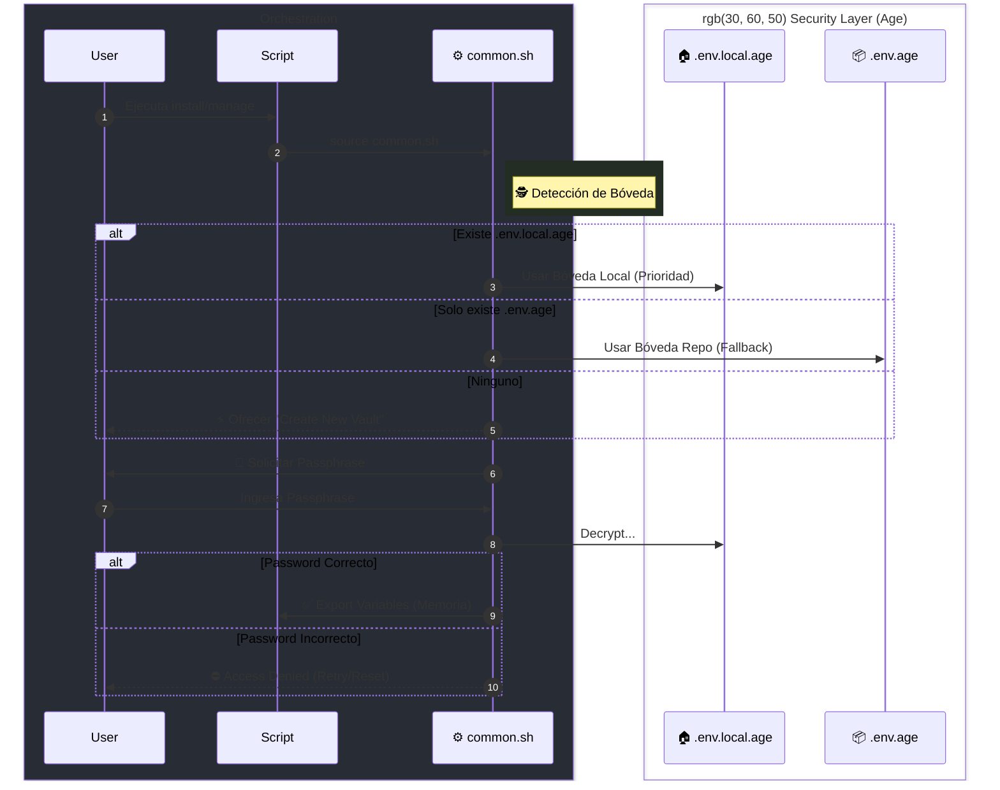

# 🚀 Dotfiles

> **Tu entorno de desarrollo, automatizado** — Configuración unificada y reproducible para Linux (Ubuntu, Fedora, Arch, WSL).

<!-- BADGES: Usa style=flat-square -->
[](https://www.gnu.org/software/bash/)
[](https://www.linux.org/)
[](LICENSE)
[](https://github.com/FiloSottile/age)

<p align="center">
  
</p>

---

## 📑 Índice

- [🎯 ¿Qué es este proyecto?](#-qué-es-este-proyecto)
- [✨ Características](#-características)
- [⚡ Prerequisitos OBLIGATORIOS](#-prerequisitos-obligatorios)
  - [🔑 Generar Llaves SSH](#-paso-1-generar-llaves-ssh)
  - [📤 Agregar Llave a GitHub](#-paso-2-agregar-llave-pública-a-github)
  - [⚙️ Configurar SSH Config](#-paso-3-configurar-ssh-config)
  - [🔐 SSH Agent y Forwarding](#-paso-4-ssh-agent-y-forwarding)
  - [🪟 Configuración WSL](#-configuración-especial-para-wsl)
- [🚀 Instalación](#-instalación)
- [🏗️ Arquitectura](#️-arquitectura)
- [📦 ¿Qué instalamos y por qué?](#-qué-instalamos-y-por-qué)
- [🎨 Módulos Disponibles](#-módulos-disponibles)
- [🔐 Gestión de Secretos](#-gestión-de-secretos-envage)
- [🐧 Configuración WSL (Antigravity)](#-configuración-wsl)
- [🔧 Aliases Incluidos](#-aliases-incluidos)
- [📚 Documentación](#-documentación)
- [🛠️ Stack Tecnológico](#️-stack-tecnológico)
  - [🚀 Configuración de Atuin](#-configuración-de-atuin-historial-inteligente)
- [🧠 Filosofía de Desarrollo](#-filosofía-de-desarrollo)
- [🔧 Orden de Inicialización en .bashrc](#-orden-de-inicialización-en-bashrc)
- [🗑️ Desinstalación](#️-desinstalación-total)
- [🔒 Seguridad](#-seguridad)
- [❓ FAQ y Troubleshooting](#-faq-y-troubleshooting)
- [🤝 Contribuir](#-contribuir)

---

## 🎯 ¿Qué es este proyecto?

**Dotfiles** es un sistema de automatización completo para configurar entornos de desarrollo Linux desde cero. Diseñado para:

- 🎓 **Desarrolladores nuevos**: Guía paso a paso desde la generación de SSH hasta el entorno completo
- 🏢 **Equipos**: Configuración reproducible en múltiples máquinas
- 🔄 **Migraciones**: Restaura tu entorno en minutos en un servidor nuevo

**¿Qué hace diferente a estos dotfiles?**

| Característica | Beneficio |
|:---------------|:----------|
| 🔍 **Transparencia Total** | Cada paquete tiene documentación de por qué se instala |
| 🎯 **Modular** | Instala solo lo que necesitas (sistema, dev, IA, cloud) |
| 🔐 **Seguro por Defecto** | Gestión de secretos con Age encryption |
| 📖 **Documentación Completa** | Guías paso a paso para usuarios sin experiencia previa |
| 🤖 **IA-Ready** | Integración con Gemini/Antigravity y workflows automatizados |

---

## ✨ Características

| Característica              | Descripción                                                                                                                                                                                                           |
| :-------------------------- | :-------------------------------------------------------------------------------------------------------------------------------------------------------------------------------------------------------------------- |
| 🔹 **Sistema Base**          | Configuración esencial optimizada con herramientas modernas: `vim`, `tmux`, `fzf`, `ranger`, `htop`, `btop`.                                                                                                          |
| 🎨 **UI/UX Premium**         | Terminal moderna con **Oh My Posh** (Tema `herwingx`), **lsd** y **Nerd Fonts** (Recomendada: `Maple Mono NF`).                                                                                                       |
| 🔸 **Dev Suite**             | Toolkit completo para desarrollo: Docker, GitHub CLI (`gh`), Node.js (via nvm) y utilidades CLI modernas.                                                                                                             |
| 🔐 **Seguridad Zero-Config** | Gestión de secretos con encriptación Age (`.env.age`). Las credenciales se extraen en runtime, nunca expuestas en código.                                                                                             |
| 🤖 **Antigravity AI**        | Integración completa con Gemini: `GEMINI.md` con reglas de desarrollo, workflows automatizados (`/commit`, `/release`), extensiones **MCP** (Chrome DevTools, GitHub, Postgres) y configuración automática de tokens. |
| ☁️ **Cloud Tools**           | Configuración automática de `rclone` para sincronización con Google Drive. El token se extrae de secretos encriptados.                                                                                                |
| 🖥️ **Soporte WSL**           | Integración nativa con Windows Subsystem for Linux, incluyendo copiado automático de llaves SSH y configuración transparente.                                                                                         |
| 🔄 **Auto-Update**           | Sistema de actualizaciones automáticas con notificaciones vía Telegram. Configurable con horarios personalizados para evitar conflictos.                                                                              |
| 📦 **Multi-Distro**          | Compatible con Debian/Ubuntu (apt), Fedora/RHEL (dnf) y Arch Linux (pacman). Detección automática de distribución.                                                                                                    |

---

## ⚡ Prerequisitos OBLIGATORIOS

> 🎯 **IMPORTANTE**: Si eres un usuario nuevo, **LEE ESTA SECCIÓN COMPLETA** antes de ejecutar el instalador. La configuración SSH es el fundamento de todo el flujo de trabajo moderno con Git y servidores remotos.

### Requisitos del Sistema

| Requisito       | Descripción                                                              |
| :-------------- | :----------------------------------------------------------------------- |
| 🐧 **Sistema**   | Linux (Debian, Ubuntu, Fedora, Arch) o WSL                               |
| 🌐 **Conexión**  | Acceso a Internet para descargar paquetes                                |
| 🔐 **Git/GitHub**| Cuenta de GitHub (gratuita) para clonar y contribuir                     |
| 🔑 **SSH Keys**  | **OBLIGATORIO** - Crearemos esto juntos en los próximos pasos            |

---

## 🔑 Paso 1: Generar Llaves SSH

Las llaves SSH te permiten autenticarte con GitHub y servidores remotos **sin contraseñas**. Son el estándar de la industria.

### 🪟 Opción A: Windows (Nativo)

Si trabajas en Windows (incluso si usarás WSL después), genera tus llaves **primero en Windows**:

#### 1.1. Abrir PowerShell o Git Bash

- Presiona `Win + X` → Selecciona **"Windows PowerShell"** o **"Terminal"**
- O usa **Git Bash** si ya lo tienes instalado

#### 1.2. Generar la llave

```powershell
# Comando para generar llave SSH con algoritmo Ed25519 (más seguro y rápido que RSA)
ssh-keygen -t ed25519 -C "tu_email@ejemplo.com"
```

**Preguntas que te hará:**

1. **"Enter file in which to save the key"**: 
   - Presiona `Enter` para usar la ruta por defecto: `C:\Users\TU_USUARIO\.ssh\id_ed25519`

2. **"Enter passphrase"**: 
   - **RECOMENDADO**: Ingresa una contraseña segura (se pedirá cada vez que uses la llave)
   - **Opcional**: Presiona `Enter` para sin contraseña (menos seguro, pero más conveniente)

#### 1.3. Verificar que se creó

```powershell
# Listar archivos creados
ls ~/.ssh/

# Deberías ver:
# id_ed25519     ← Llave PRIVADA (NUNCA compartir)
# id_ed25519.pub ← Llave PÚBLICA (esta sí puedes compartir)
```

---

### 🐧 Opción B: Linux / WSL

Si estás en Linux puro o ya dentro de WSL:

#### 1.1. Abrir tu terminal

```bash
# Generar llave SSH
ssh-keygen -t ed25519 -C "tu_email@ejemplo.com"
```

#### 1.2. Responder las preguntas

1. **"Enter file in which to save the key"**: 
   - Presiona `Enter` para usar `/home/TU_USUARIO/.ssh/id_ed25519`

2. **"Enter passphrase"**: 
   - Ingresa una contraseña o deja vacío

#### 1.3. Verificar

```bash
ls -la ~/.ssh/

# Deberías ver:
# id_ed25519     (Permisos: 600)
# id_ed25519.pub (Permisos: 644)
```

---

## 📤 Paso 2: Agregar Llave Pública a GitHub

Para que GitHub te reconozca y puedas hacer `git clone`, `git push`, etc., debes subir tu **llave pública**.

### 2.1. Copiar la Llave Pública

**Windows (PowerShell/Git Bash):**
```powershell
# Copiar al portapapeles
cat ~/.ssh/id_ed25519.pub | clip

# O mostrar en pantalla para copiar manualmente
cat ~/.ssh/id_ed25519.pub
```

**Linux/WSL:**
```bash
# Mostrar en pantalla
cat ~/.ssh/id_ed25519.pub

# Si tienes xclip instalado (Ubuntu Desktop)
cat ~/.ssh/id_ed25519.pub | xclip -selection clipboard

# En WSL, copiar a portapapeles de Windows
cat ~/.ssh/id_ed25519.pub | clip.exe
```

### 2.2. Agregar a GitHub

1. Ve a: [https://github.com/settings/keys](https://github.com/settings/keys)
2. Click en **"New SSH key"**
3. **Title**: Nombre descriptivo (ej: "Laptop Personal", "PC Trabajo WSL")
4. **Key type**: `Authentication Key`
5. **Key**: Pega el contenido completo (empieza con `ssh-ed25519 AAAA...`)
6. Click en **"Add SSH key"**

### 2.3. Probar la Conexión

```bash
# Verificar que GitHub te reconoce
ssh -T git@github.com

# Respuesta esperada:
# Hi TU_USUARIO! You've successfully authenticated, but GitHub does not provide shell access.
```

> ✅ Si ves tu usuario de GitHub en el mensaje, **¡la configuración es correcta!**

---

## ⚙️ Paso 3: Configurar SSH Config

El archivo `~/.ssh/config` te permite definir **atajos** y **configuraciones** para tus conexiones SSH.

### 3.1. Crear/Editar el archivo

**Linux/WSL:**
```bash
# Crear carpeta si no existe
mkdir -p ~/.ssh

# Editar con tu editor favorito
nano ~/.ssh/config
# o
vim ~/.ssh/config
```

**Windows:**
```powershell
# Crear carpeta si no existe
mkdir -Force ~/.ssh

# Editar (usa notepad o VSCode)
notepad $HOME\.ssh\config
```

### 3.2. Configuración Básica Recomendada

Copia y pega esta configuración base:

```ssh
# ~/.ssh/config

# ========================================
# CONFIGURACIÓN GLOBAL
# ========================================
# Aplica a TODOS los hosts
Host *
    # Agregar llaves automáticamente al agente SSH
    AddKeysToAgent yes
    
    # Habilitar SSH Agent Forwarding (usar tus llaves locales en servidores remotos)
    ForwardAgent yes
    
    # Evitar timeouts en conexiones largas inactivas
    ServerAliveInterval 60
    ServerAliveCountMax 120
    
    # Reutilizar conexiones para acelerar múltiples comandos
    ControlMaster auto
    ControlPath ~/.ssh/sockets/%r@%h-%p
    ControlPersist 600

# ========================================
# GITHUB
# ========================================
Host github.com
    HostName github.com
    User git
    IdentityFile ~/.ssh/id_ed25519
    # Usar IPv4 preferentemente (evita problemas con IPv6)
    AddressFamily inet

# ========================================
# EJEMPLO: Servidor Remoto
# ========================================
# Puedes agregar tus propios servidores aquí
# Host mi-servidor
#     HostName 192.168.1.100
#     User usuario
#     Port 22
#     IdentityFile ~/.ssh/id_ed25519
```

### 3.3. Crear carpeta de sockets (para ControlMaster)

```bash
mkdir -p ~/.ssh/sockets
```

### 3.4. Asegurar Permisos Correctos

```bash
# CRÍTICO: SSH rechaza configuraciones con permisos inseguros
chmod 700 ~/.ssh
chmod 600 ~/.ssh/config
chmod 600 ~/.ssh/id_ed25519
chmod 644 ~/.ssh/id_ed25519.pub
```

---

## 🔐 Paso 4: SSH Agent y Forwarding

El **SSH Agent** mantiene tus llaves en memoria para no pedir la contraseña en cada conexión.

### 4.1. Iniciar el Agente (Automático en dotfiles)

Los dotfiles configuran esto automáticamente en `.bashrc`, pero puedes verificarlo:

```bash
# Verificar si el agente está corriendo
echo $SSH_AUTH_SOCK

# Debe mostrar algo como:
# /tmp/ssh-XXXXXX/agent.12345
```

### 4.2. Agregar tu Llave al Agente

```bash
# Agregar llave (te pedirá la contraseña si configuraste una)
ssh-add ~/.ssh/id_ed25519

# Verificar que se agregó correctamente
ssh-add -l

# Debe mostrar:
# 256 SHA256:... tu_email@ejemplo.com (ED25519)
```

### 4.3. SSH Agent Forwarding (Uso Avanzado)

**¿Qué es?** Permite usar tus llaves **locales** dentro de servidores remotos **sin copiarlas**.

**Caso de Uso:**
```
Tu Laptop → Servidor A → Servidor B
          └─ Usa tus llaves locales en A
                         └─ Usa tus llaves locales en B (sin copiarlas)
```

**Ya configurado en `~/.ssh/config` con:**
```ssh
Host *
    ForwardAgent yes
```

**Probar Forwarding:**
```bash
# 1. Conectarte a un servidor
ssh usuario@servidor-remoto

# 2. YA DENTRO del servidor, verificar que ves tus llaves locales
ssh-add -l

# Si ves tu llave local listada, ¡el forwarding funciona! 🎉
```

> ⚠️ **Seguridad**: Solo usa `ForwardAgent yes` en servidores de confianza. Si un servidor está comprometido, podría usar tus llaves mientras estás conectado.

---

## 🪟 Configuración Especial para WSL

Si usas Windows Subsystem for Linux, necesitas **copiar** o **vincular** tus llaves de Windows a WSL.

### Método 1: Copiado Automático (Recomendado)

El instalador incluye una opción que copia las llaves automáticamente:

```bash
# Después de clonar los dotfiles en WSL
cd ~/dotfiles
./install.sh

# Selecciona la opción:
# [9] 🪟 Sincronizar SSH desde Windows
```

### Método 2: Copiado Manual

```bash
# Copiar llaves de Windows a WSL
cp /mnt/c/Users/TU_USUARIO_WINDOWS/.ssh/id_ed25519* ~/.ssh/

# Asegurar permisos correctos (CRÍTICO)
chmod 700 ~/.ssh
chmod 600 ~/.ssh/id_ed25519
chmod 644 ~/.ssh/id_ed25519.pub
```

### Método 3: Symlink (Avanzado)

Crear un enlace simbólico para compartir las mismas llaves:

```bash
# ADVERTENCIA: WSL puede tener problemas con permisos en /mnt/c
# Solo usa esto si entiendes las implicaciones de seguridad

ln -s /mnt/c/Users/TU_USUARIO_WINDOWS/.ssh ~/.ssh
```

> 💡 **Recomendación**: Usa el Método 1 (automático) o Método 2 (manual) para evitar problemas de permisos.

---

## 🚀 Instalación

Una vez que tienes tus **llaves SSH configuradas y agregadas a GitHub**, puedes proceder con la instalación de los dotfiles.

### 1. Clonar el Repositorio

```bash
# Clonar usando SSH (por eso necesitábamos configurar SSH primero)
git clone git@github.com:herwingx/dotfiles.git ~/dotfiles

# Entrar al directorio
cd ~/dotfiles
```

> 🔍 **Nota**: Si ves un error `Permission denied (publickey)`, revisa los pasos de SSH anteriores.

### 2. Ejecutar el Instalador

```bash
# Dar permisos de ejecución
chmod +x install.sh

# Ejecutar instalador interactivo
./install.sh
```

### 3. Menú Interactivo High-Tech

El instalador presenta una interfaz técnica estilo **Cyberpunk/Hacker** para control total:

```text
  ██████╗  ██████╗ ████████╗███████╗██╗██╗     ███████╗███████╗
  ██╔══██╗██╔═══██╗╚══██╔══╝██╔════╝██╔╝██║     ██╔════╝██╔════╝
  ██║  ██║██║   ██║   ██║   █████╗  ██║██║     █████╗  ███████╗
  ██║  ██║██║   ██║   ██║   ██╔══╝  ██║██║     ██╔══╝  ╚════██║
  ██████╔╝╚██████╔╝   ██║   ██║     ██║███████╗███████╗███████║
  ╚═════╝  ╚═════╝    ╚═╝   ╚═════╝ ╚═╝╚══════╝╚══════╝╚══════╝
                             v2.0_PREMIUM_BUILD // SYSTEM_READY

  // 🚀 INSTALACIÓN AUTOMÁTICA
  +------------------------------------------------------------+
  [1 ] Instalar TODO (Full Stack + IA + Cloud)
  +------------------------------------------------------------+
  [2 ] Solo Sistema (Esenciales + Shell)  [3 ] Solo Dev Tools (Docker + Node)
  [4 ] Solo Antigravity AI (Reglas + Flows)
  +------------------------------------------------------------+

  // 📦 MÓDULOS DE SISTEMA
  [5 ] Actualizar Sistema (OS Upgrade)    [6 ] Paquetes Base (vim, fzf, tmux...)
  [7 ] Configurar Git y Alias             [8 ] Importar Keys SSH (desde GitHub)
  [9 ] Sincronizar SSH desde Windows (WSL)

  // 🛠️ HERRAMIENTAS DEV
  [10] Instalar GitHub CLI (gh)           [11] Instalar Node.js (LTS)
  [12] Instalar Globales NPM              [13] Instalar Docker Engine

  // ☁️ CLOUD & INTEGRACIÓN IA
  [14] Instalar Reglas IA (GEMINI.md)    [15] Instalar Comandos Slash (/commit...)
  [16] Desencriptar/Cargar Secretos      [17] Crear Nueva Bóveda (Reset Secrets)
  [18] Configurar Rclone (Google Drive)

  // 🔄 MANTENIMIENTO
  [19] Activar Auto-Updates              [20] Ejecutar Update Manual
  [21] Desactivar Auto-Updates

  +------------------------------------------------------------+
  [0 ] ABORT / EXIT

  [TIP] Press Ctrl+C to force quit at any time
  wrapper@install:~$ 
```

### 4. Seleccionar Opción de Instalación

| Opción | Recomendado Para | Qué Instala |
|:------:|:-----------------|:------------|
| **[1]** | 🎯 **Usuarios Nuevos** / Máquina de desarrollo personal | **TODO**: Sistema base + Dev Tools + Docker + Gemini AI + Cloud + Auto-Updates |
| **[2]** | Servidores / Entornos ligeros | Sistema base + Shell moderno + Git + Aliases |
| **[3]** | Solo necesitas Docker/Node | GitHub CLI + NVM/Node.js + Docker |
| **[4]** | Solo configuración de IA | Reglas Gemini + Workflows + MCP Extensions |

> 📘 **Recomendación para Primera Instalación**: Selecciona **[1]** para obtener el stack completo.

### 5. Post-Instalación

Después de la instalación, **recarga tu shell**:

```bash
# Opción 1: Cerrar y abrir una nueva terminal

# Opción 2: Recargar configuración
source ~/.bashrc
```

---

## 🏗️ Arquitectura

El proyecto sigue una arquitectura **modular** donde cada script tiene una responsabilidad específica:

```
dotfiles/
├── install.sh              # 🚀 Orquestador principal (menú interactivo)
├── uninstall.sh            # 🗑️ Script de limpieza total
├── README.md               # 📖 Documentación del proyecto
├── .env.age                # 🔐 Secrets encriptados del repo (backup)
├── .env.example            # 📄 Plantilla de variables de entorno
│
├── config/                 # 📁 Archivos de configuración (dotfiles puros)
│   ├── .bash_aliases       # Aliases de terminal (gs, ga, ll, etc.)
│   ├── .gitconfig          # Configuración global de Git
│   ├── .tmux.conf          # Configuración de Terminal Multiplexer
│   └── herwingx.omp.json   # 🎨 Tema visual de Oh My Posh
│
├── scripts/                # 🔧 Módulos de instalación
│   ├── common.sh           # Variables globales, helpers UI y Crypto
│   ├── system.sh           # Actualización sistema, paquetes base
│   ├── git.sh              # Configuración Git y SSH keys
│   ├── dev-tools.sh        # GitHub CLI, NVM, Docker
│   ├── antigravity.sh      # Reglas IA y workflows
│   ├── cloud.sh            # Configuración rclone
│   ├── cron-update.sh      # Auto-Update
│   └── manage_secrets.sh   # 🔐 Gestor interactivo de bóvedas
│
├── docs/                   # 📚 Documentación adicional
│   └── WSL.md              # Guía específica para Windows Subsystem for Linux
│
└── gemini/                 # 🤖 Configuración Antigravity/Gemini
    ├── README.md           # Docs de extensiones MCP
    ├── GEMINI.md           # Reglas globales de desarrollo
    ├── settings.json       # Configuración CLI (MCPs, tokens)
    └── workflows/          # ⚡ Comandos slash automatizados
        ├── commit.md       # /commit       (Conventional Commits)
        ├── crear-pr.md     # /crear-pr     (Pull Request Template)
        ├── crear-readme.md # /crear-readme (Docs Generator)
        ├── release.md      # /release      (GitHub Release)
        ├── publicar.md     # /publicar     (Push Automático)
        ├── sync-main.md    # /sync-main    (Rebase)
        └── limpiar-ramas.md # /limpiar-ramas (Cleanup)
```

### Diagrama de Flujo


```mermaid
flowchart TD
    subgraph ENTRY["🎛️ Entry Points"]
        A["🚀 install.sh"] --> B["⚙️ common.sh"]
        M["🔐 manage_secrets.sh"] --> B
        U["🗑️ uninstall.sh"] --> B
    end

    B --> C{"🎯 Menú Interactivo"}

    subgraph MODULES["📂 Módulos de Instalación"]
        direction LR
        D["🖥️ system.sh"]
        E["🔑 git.sh"]
        F["🛠️ dev-tools.sh"]
        G["🤖 antigravity.sh"]
        H["☁️ cloud.sh"]
        I["🔄 cron-update.sh"]
    end

    C --> D & E & F & G & H & I

    subgraph OUTPUTS["✅ Resultados"]
        O1["Paquetes + Shell"]
        O2["Git + SSH"]
        O3["Docker + Node + gh"]
        O4["IA + Workflows + MCP"]
        O5["Rclone + GDrive"]
        O6["Auto-Updates"]
    end

    D --> O1
    E --> O2
    F --> O3
    G --> O4
    H --> O5
    I --> O6

    subgraph SECRETS["🔐 Dual Vault Architecture"]
        S1["🏠 .env.local.age<br/>(Prioridad User)"]
        S2["📦 .env.age<br/>(Backup Repo)"]
        DEC["🔓 decrypt_secrets()"]
        
        S1 --> DEC
        S2 -.-> S1
    end

    B -.->|"Carga/Crea"| SECRETS
    DEC -.->|"Variables OK"| MODULES
```

---

## 📦 ¿Qué instalamos y por qué?

> 🔍 **Principio de Transparencia**: A diferencia de otros dotfiles que instalan paquetes sin explicación, aquí documentamos **cada herramienta** y su propósito.

### Categoría: Sistema Base

| Paquete | ¿Qué hace? | ¿Por qué lo instalamos? |
|:--------|:-----------|:------------------------|
| **git** | Sistema de control de versiones distribuido | Fundamental para clonar repos, versionar código y colaborar |
| **curl** | Cliente HTTP en línea de comandos | Descargar archivos, consumir APIs REST, scripts de instalación |
| **wget** | Descargador de archivos | Alternativa a curl, soporta descargas recursivas |
| **vim** | Editor de texto modal avanzado | Editor universal disponible en todos los servidores |
| **micro** | Editor moderno con atajos estilo GUI | Alternativa a vim con curva de aprendizaje más suave (Ctrl+S, Ctrl+C) |
| **tmux** | Multiplexor de terminal | Sesiones persistentes, ventanas/paneles, trabajo remoto sin pérdida de sesión |
| **htop** / **btop** | Monitores de sistema interactivos | btop: Monitor moderno con gráficos; htop: Clásico ligero |
| **build-essential** | Compiladores (gcc, g++, make) | Necesarios para compilar software desde fuente (ej: ble.sh, extensiones npm) |
| **gawk** | Procesador de texto (GNU awk) | Requerido específicamente por ble.sh para procesamiento avanzado de texto |

### Categoría: Herramientas Modernas de Terminal

| Paquete | ¿Qué hace? | ¿Por qué lo instalamos? |
|:--------|:-----------|:------------------------|
| **lsd** | Reemplazo moderno de `ls` | Listados con iconos, colores semánticos, y tree view integrado |
| **bat** | Reemplazo de `cat` con syntax highlighting | Lectura de código con resaltado, integración Git, paginación automática |
| **fzf** | Fuzzy finder interactivo | Búsqueda rápida de archivos, historial, comandos (Ctrl+R) |
| **zoxide** | CD inteligente con aprendizaje | Salta a directorios frecuentes con `z nombre-parcial` |
| **delta** | Visor de diffs Git mejorado | Diffs lado a lado con syntax highlighting |
| **ripgrep** | Búsqueda de texto extremadamente rápida | Alternativa a `grep` 10x más rápida, respeta `.gitignore` |
| **ranger** | File manager TUI con preview | Navegación visual de archivos con preview de imágenes/código |
| **tldr** | Páginas de ayuda simplificadas | Alternativa a `man` con ejemplos prácticos concisos |
| **ble.sh** | Bash Line Editor | Syntax highlighting en tiempo real, autosuggestions, mejor autocompletado |
| **oh-my-posh** | Engine de prompts personalizados | Prompt informativo con Git status, duración de comandos, nivel de batería |

### Categoría: Herramientas de Desarrollo

| Paquete | ¿Qué hace? | ¿Por qué lo instalamos? |
|:--------|:-----------|:------------------------|
| **GitHub CLI (gh)** | Cliente oficial de GitHub | Crear repos, PRs, releases desde terminal. Integrado con MCP de Gemini |
| **Docker Engine** | Plataforma de containerización | Desarrollo sin contaminar el sistema, reproducibilidad, microservicios |
| **docker-compose** | Orquestación de multi-containers | Definir stacks completos (app + DB + cache) en un solo archivo YAML |
| **NVM** | Node Version Manager | Cambiar entre versiones de Node.js por proyecto |
| **Node.js LTS** | Runtime de JavaScript | Necesario para herramientas modernas (Gemini CLI, npm globals) |
| **lazydocker** | TUI para gestionar Docker | Interfaz visual para containers, logs, stats sin memorizar comandos |
| **ctop** | Top para containers | Monitoreo en tiempo real de uso de recursos por container |
| **gping** | Ping con gráficos | Diagnóstico de red visual con latencia histórica |

### Categoría: Seguridad y Secretos

| Paquete | ¿Qué hace? | ¿Por qué lo instalamos? |
|:--------|:-----------|:------------------------|
| **age** | Encriptación de archivos moderna | Proteger `.env.age` con secretos (tokens, API keys) |
| **Bitwarden CLI (bw)** | Gestor de contraseñas en terminal | Extracción automática de credenciales desde vault |
| **xz-utils** | Compresor/descompresor XZ | Necesario para desempaquetar binarios npm y herramientas comprimidas |
| **unzip** | Descompresor ZIP | Instalación de paquetes y extensiones distribuidas en .zip |

### Categoría: Antigravity / Gemini

| Componente | ¿Qué hace? | ¿Por qué lo instalamos? |
|:-----------|:-----------|:------------------------|
| **gemini-cli** | Cliente de Google Gemini | Asistente IA en terminal con acceso a MCP servers |
| **GEMINI.md** | Reglas globales de desarrollo | Protocolo de Clean Code, Git Flow, Conventional Commits para IA |
| **Workflows** | Comandos slash (`/commit`, `/release`) | Automatización de flujos Git con mejores prácticas incorporadas |
| **MCP Extensions** | Chrome DevTools, GitHub, Postgres | Extienden capacidades de Gemini para debugging, Git, DB |

---

## 🎨 Módulos Disponibles

### Instalación Rápida (Agrupada)

| Opción | Descripción                                                       | Modo | Ideal para                    |
| :----: | :---------------------------------------------------------------- | :--- | :---------------------------- |
|   1    | **Instalar TODO**: Full Stack + IA + Cloud + Auto-Update          | 🤖 **Automático** (instala todo sin preguntar) | Máquina nueva de desarrollo   |
|   2    | **Solo Sistema**: Update + Paquetes + Tools + Aliases + Git + SSH | 💬 Interactivo | Servidores o entornos ligeros |
|   3    | **Solo Dev Tools**: GitHub CLI + NVM/Node.js + Docker             | 💬 Interactivo | Entornos de desarrollo        |
|   4    | **Solo Antigravity AI**: Reglas GEMINI.md + Workflows IA          | 💬 Interactivo | Solo configuración de IA      |

> 💡 **Modo Automático vs Interactivo**:
> - **Opción 1 (TODO)**: Instala automáticamente todas las herramientas, incluido Gemini CLI si tienes Node.js
> - **Opciones individuales**: Te pregunta antes de instalar paquetes opcionales como Gemini CLI

### 📦 Módulos de Sistema

| Opción | Módulo            | Descripción                                                                                                      |
| :----: | :---------------- | :--------------------------------------------------------------------------------------------------------------- |
|   5    | Actualizar Sistema| Ejecuta `apt upgrade` / `dnf upgrade` / `pacman -Syu`                                                            |
|   6    | Paquetes Base     | Instala: git, curl, vim, micro, tldr, tmux, fzf, ranger, oh-my-posh, lsd, lazydocker, ctop, gping y herramientas de compilación. |
|   7    | Configurar Git    | Vincula `.gitconfig` con configuración global optimizada                                                         |
|   8    | Importar Keys SSH | Importa llaves SSH públicas desde GitHub (via API)                                                               |
|   9    | Sincronizar SSH   | Copia llaves SSH desde Windows a WSL (solo aplica en WSL)                                                        |

### 🛠️ Herramientas Dev

| Opción | Módulo        | Descripción                                                            |
| :----: | :------------ | :--------------------------------------------------------------------- |
|   10   | GitHub CLI    | Instala `gh` y configura autenticación automática via Bitwarden        |
|   11   | NVM + Node.js | Instala Node Version Manager y la última versión LTS de Node.js        |
|   12   | Globales NPM  | Instala globalmente: `@anthropics/claude-code`, `@bitwarden/cli`       |
|   13   | Docker Engine | Instala Docker CE + Docker Compose con configuración de grupo `docker` |

### ☁️ Cloud & Integración IA

| Opción | Módulo              | Descripción                                                                                  |
| :----: | :------------------ | :------------------------------------------------------------------------------------------- |
|   14   | Reglas IA           | Instala `GEMINI.md` en `~/.gemini/` con reglas de desarrollo para asistentes IA              |
|   15   | Comandos Slash      | Instala workflows slash (`/commit`, `/release`, `/publicar`) en `~/.gemini/workflows/`       |
|   16   | **Decrypt Secrets** | Desencripta `.env.age` o `.env.local.age` y carga variables en sesión                        |
|   17   | **New Vault**       | **Crea una nueva bóveda local** y archiva la original (Ideal para Forks)                     |
|   18   | Configurar Rclone   | Configura rclone para Google Drive usando token desde secrets                                |

### 🔄 Mantenimiento

| Opción | Módulo              | Descripción                                                             |
| :----: | :------------------ | :---------------------------------------------------------------------- |
|   19   | Activar Auto-Update | Instala cronjob de actualización automática con notificaciones Telegram |
|   20   | Update Manual       | Ejecuta manualmente el script de actualización (para testing)           |
|   21   | Desactivar Auto-Up  | Elimina el cronjob de auto-update                                       |

---

## 🔐 Gestión de Secretos (.env.age)
 
Este repositorio utiliza **[Age](https://github.com/FiloSottile/age)** para proteger variables sensibles. Los secretos se encriptan con passphrase y se desencriptan solo en runtime.
 
### Arquitectura de Bóvedas (Prioridad)
 
El sistema maneja dos niveles de secretos para facilitar la colaboración:
 
1.  🥇 **`.env.local.age` (Prioridad Alta)**: Tu bóveda personal. Si existe, el sistema la usa y **ignora** la del repositorio. Este archivo está en `.gitignore` para que nunca se suba por error.
2.  🥈 **`.env.age` (Fallback)**: La bóveda distribuida con el repositorio (útil para backup personal del autor).
 
> 🔱 **Forks Safe**: Si haces fork de este proyecto, simplemente crea tu propia bóveda local (Opción 17). El sistema la priorizará automáticamente y te ofrecerá archivar la original.
 
### ¿Por qué Encriptar? (Importante)
 
La encriptación con **Age** te permite:
 
*   ✅ **Backup Seguro**: Puedes hacer commit de `.env.age` si lo deseas (usando una passphrase fuerte).
*   ✅ **Portabilidad**: Al instalar tus dotfiles en otra máquina, desencriptas y listo.
*   ✅ **Fork Friendly**: Los colaboradores no ven tus secretos, y pueden crear los suyos propios en `.env.local.age`.

### Variables Soportadas

| Variable             | Descripción                                 | Uso                                                       |
| :------------------- | :------------------------------------------ | :-------------------------------------------------------- |
| `BW_CLIENTID`        | Client ID de API de Bitwarden               | Autenticación automática de `bw` CLI                      |
| `BW_CLIENTSECRET`    | Client Secret de API de Bitwarden           | Autenticación automática de `bw` CLI                      |
| `GH_TOKEN`           | Personal Access Token de GitHub             | Autenticación de `gh` CLI y **extensiones MCP de Gemini** |
| `RCLONE_TOKEN_JSON`  | Token OAuth de Google Drive (JSON completo) | Configuración automática de rclone                        |
| `TELEGRAM_BOT_TOKEN` | Token del bot de Telegram                   | Notificaciones de auto-update                             |
| `TELEGRAM_CHAT_ID`   | ID del chat para notificaciones             | Destino de notificaciones Telegram                        |

### Configuración de Bitwarden (Oficial vs Self-Hosted)

Por defecto, la CLI de Bitwarden (`bw`) apunta a los servidores oficiales (`bitwarden.com`). 
Si utilizas una instancia **Self-Hosted (Vaultwarden)**, debes cambiar la URL del servidor manualmente:

**Para usar Vaultwarden (Self-Hosted):**
```bash
bw config server https://tu-instancia-vaultwarden.com
```

**Para volver a Bitwarden Oficial:**
```bash
bw config server https://bitwarden.com
```

> ⚠️ **Importante**: Las API Keys (`BW_CLIENTID` y `BW_CLIENTSECRET`) son específicas de cada servidor. Si cambias de servidor, debes regenerar las keys en la web correspondiente y actualizar tu archivo `.env.age`.

### Script de Gestión

```bash
./scripts/manage_secrets.sh
```

**Opciones disponibles:**

| Opción | Acción     | Descripción                                              |
| :----: | :--------- | :------------------------------------------------------- |
|   1    | **Editar** | Crea/Desencripta → Edita → Encripta (pide password)      |
|   2    | **Ver**    | Muestra el contenido desencriptado en consola (temporal) |

> 💡 **Creación Inicial**: Si aún no tienes un archivo `.env.age`, selecciona la opción **1**. El script creará uno nuevo, abrirá el editor y te pedirá una passphrase para encriptarlo al guardar.

### Flujo de Descifrado


```mermaid
sequenceDiagram
    autonumber
    
    box rgb(40, 44, 52) Orchestration
        participant User
        participant Script
        participant Common as ⚙️ common.sh
    end
    
    box rgb(30, 60, 50) Security Layer (Age)
        participant Local as 🏠 .env.local.age
        participant Repo as 📦 .env.age
    end
    
    User->>Script: Ejecuta install/manage
    Script->>Common: source common.sh
    
    rect rgb(35, 45, 35)
        Note right of Common: 🕵️ Detección de Bóveda
    end
    
    alt Existe .env.local.age
        Common->>Local: Usar Bóveda Local (Prioridad)
    else Solo existe .env.age
        Common->>Repo: Usar Bóveda Repo (Fallback)
    else Ninguno
        Common-->>User: ⚡ Ofrecer "Create New Vault"
    end
    
    Common->>User: 🔑 Solicitar Passphrase
    User->>Common: Ingresa Passphrase
    
    Common->>Local: Decrypt...
    
    alt Password Correcto
        Common->>Script: ✅ Export Variables (Memoria)
    else Password Incorrecto
        Common-->>User: ⛔ Access Denied (Retry/Reset)
    end
```

---

## 🐧 Configuración WSL

Si ejecutas estos dotfiles en **Windows Subsystem for Linux (WSL)**, el instalador aplica configuraciones especiales automáticamente.

### 🛡️ Limpieza Automática del PATH

**Problema detectado**: En WSL, el `PATH` incluye rutas de Windows (`/mnt/c/*`) que pueden causar conflictos con binarios de Linux.

**Solución aplicada**: El instalador agrega automáticamente a tu `.bashrc`:

```bash
# WSL: Limpiar PATH de Windows (evitar conflictos con binarios .exe)
if grep -qi microsoft /proc/version 2>/dev/null; then
    # Filtrar rutas de /mnt/* del PATH
    NEW_PATH=$(echo "$PATH" | tr ':' '\n' | grep -v '^/mnt/' | tr '\n' ':' | sed 's/:$//')
    export PATH="$NEW_PATH"
fi
```

#### ¿Por qué es necesario?

| Problema | Consecuencia | Solución |
| :------- | :----------- | :------- |
| `nvm4w` de Windows en PATH | `gemini` o `node` detectados en `/mnt/c/` no funcionan desde WSL | PATH filtrado, solo binarios de Linux |
| Extensiones MCP de Gemini fallan | Timeout o error: "Sin salida del comando" | Gemini instalado vía npm DENTRO de WSL |
| Git de Windows invocado | Problemas con line endings (CRLF vs LF) | Usa `git` de `/usr/bin/` exclusivamente |

### 🎯 Mejores Prácticas en WSL

| Herramienta | ✅ Correcto (Linux) | ❌ Incorrecto (Windows) |
| :---------- | :------------------- | :----------------------- |
| **Node.js** | `nvm install node` en WSL | `nvm4w` desde PowerShell |
| **npm global** | `npm install -g` en WSL | `npm install -g` en CMD |
| **Git** | `/usr/bin/git` | `/mnt/c/Program Files/Git/bin/git` |
| **Docker** | Docker Desktop WSL 2 | Docker Toolbox |
| **SSH Keys** | Copiar con opción "9) SSH desde Windows" | Symlink a `/mnt/c/Users/.../.ssh` |

> 💡 **Verificación**: Ejecuta `which node` y `which git`. Ambos deben apuntar a rutas en `/home/` o `/usr/bin/`, **nunca** a `/mnt/c/`.

### 🤖 Antigravity en WSL: Guía Técnica

El instalador incluye una lógica de **Detección y Reparación Inteligente** para la CLI de Antigravity (`agy`) en WSL.

#### Comportamiento del Script Automático (`system.sh`)

1.  **Detección de Entorno**: Identifica si corre en WSL. Si es un servidor Linux estándar, se omite inofensivamente.
2.  **Búsqueda de Usuario Windows**: Usa 3 estrategias (PATH, ruta absoluta y escaneo heurístico de `/mnt/c/Users`) para encontrar tu usuario de Windows, incluso si has limpiado el PATH.
3.  **Symlink Automático**: Vincula `~/.local/bin/agy` -> `antigravity.exe` de Windows.
4.  **Gestión de ID de Extensión**:
    *   **Modo Seguro (Default)**: Si la carpeta de la extensión tiene el nombre antiguo (`ms-vscode-remote...`), el script asegura que el lanzador use el ID `ms-vscode-remote.remote-wsl`.
    *   **Auto-Reparación**: Si detecta que el ID está configurado a `google...` pero la carpeta no existe, lo **revierte automáticamente**.
    *   **Modo Nativo**: Solo si detecta manualmente la carpeta `antigravity-remote-wsl`, aplica el parche para usar el ID de Google.

#### ⚡ Cómo activar el "Modo Nativo" (Opcional)

Por defecto, `agy` abrirá como una carpeta de red (`\\wsl.localhost\...`). Si deseas la integración nativa completa:

1.  En Windows: `C:\Users\TU_USUARIO\AppData\Local\Programs\Antigravity\resources\app\extensions\`
2.  Copia la carpeta `ms-vscode-remote.remote-wsl` → Pega y renombra a: `antigravity-remote-wsl`
3.  Ejecuta `./install.sh` (Opción 6) nuevamente

### 🚀 Instalación Recomendada en WSL

```bash
# 1. Clonar dotfiles
git clone git@github.com:herwingx/dotfiles.git ~/dotfiles
cd ~/dotfiles

# 2. Ejecutar instalación completa
./install.sh
# Selecciona opción [1] Instalar TODO

# 3. Verificar que Node.js/npm están en WSL (no en Windows)
which node  # Debe devolver: /home/USER/.nvm/versions/node/vX.X.X/bin/node
which git   # Debe devolver: /usr/bin/git

# 4. Si instalaste Gemini CLI, verificar extensiones MCP
gemini extensions list
```

---

## 🔧 Aliases Incluidos

Este dotfiles incluye aliases modernos para mejorar la productividad. Se instalan en `~/.bash_aliases`.

### Navegación y Listado

| Alias | Comando Equivalente | Descripción                            |
| :---- | :------------------ | :------------------------------------- |
| `ls`  | `lsd`               | Listado moderno con iconos y colores   |
| `ll`  | `lsd -la`           | Listado detallado con archivos ocultos |
| `lt`  | `lsd --tree`        | Árbol de directorios                   |
| `la`  | `lsd -a`            | Solo archivos ocultos                  |

### Git (Workflow Optimizado)

| Alias  | Comando Equivalente       | Descripción                               |
| :----- | :------------------------ | :---------------------------------------- |
| `gs`   | `git status`              | Estado del repositorio                    |
| `ga`   | `git add`                 | Agregar archivos (`ga .` para todo)       |
| `gc`   | `git commit -m`           | Commit con mensaje (`gc "mensaje"`)       |
| `gp`   | `git push`                | Push al remoto                            |
| `gl`   | `git pull --rebase`       | Pull con rebase                           |
| `undo` | `git reset --soft HEAD~1` | Deshacer último commit (mantiene cambios) |

### Docker

| Alias  | Comando Equivalente | Descripción                 |
| :----- | :------------------ | :-------------------------- |
| `d`    | `docker`            | Shortcut para docker        |
| `dc`   | `docker compose`    | Docker Compose (`dc up -d`) |
| `dps`  | `docker ps`         | Listar containers activos   |
| `dlog` | `docker logs -f`    | Seguir logs de container    |

### Sistema

| Alias    | Comando Equivalente | Descripción                  |
| :------- | :------------------ | :--------------------------- |
| `update` | Varía por distro    | Actualizar sistema operativo |
| `ports`  | `ss -tulanp`        | Ver puertos en uso           |
| `myip`   | `curl ifconfig.me`  | IP pública                   |

---

## 📚 Documentación

| Documento                                      | Descripción                                                               |
| :--------------------------------------------- | :------------------------------------------------------------------------ |
| [gemini/README.md](gemini/README.md)           | **Guía completa de Antigravity**: Extensiones MCP, workflows, instalación |
| [GEMINI.md](gemini/GEMINI.md)                  | **Protocolo Antigravity**: Reglas globales para asistentes IA             |
| [Workflows](gemini/workflows/)                 | Flujos automatizados: `/commit`, `/release`, `/publicar`                  |
| [manage_secrets.sh](scripts/manage_secrets.sh) | Script para editar/ver secretos encriptados                               |

---

## 🛠️ Stack Tecnológico

### Core

| Tecnología        | Uso                                       |
| :---------------- | :---------------------------------------- |
| **Bash**          | Scripting y automatización del instalador |
| **Age**           | Encriptación de secretos (`.env.age`)     |
| **Bitwarden CLI** | Gestión segura de credenciales            |
| **rclone**        | Sincronización con almacenamiento cloud   |

### Herramientas de Terminal

| Herramienta    | Descripción                                    |
| :------------- | :--------------------------------------------- |
| **Atuin**      | Historial de shell mágico con sync en la nube  |
| **lsd**        | Reemplazo moderno de `ls` con iconos y colores |
| **Oh My Posh** | Motor de temas para prompt personalizado       |
| **fzf**        | Fuzzy finder para búsqueda interactiva         |
| **tmux**       | Multiplexor de terminal                        |
| **ranger**     | File manager con preview en terminal           |
| **lazydocker** | TUI para gestionar Docker                      |
| **ctop**       | Top para containers Docker                     |
| **gping**      | Ping visual con gráficos                       |
| **btop**       | Monitor de recursos moderno                    |
| **ble.sh**     | Bash Line Editor (Syntax highlight, completion) |

### Desarrollo

| Herramienta    | Descripción                           |
| :------------- | :------------------------------------ |
| **Git**        | Versionado con configuración avanzada |
| **Docker**     | Contenedorización                     |
| **NVM**        | Gestión de versiones de Node.js       |
| **GitHub CLI** | Interacción con GitHub desde terminal |

### 🚀 Configuración de Atuin (Historial Inteligente)

**Atuin** potencia tu historial de comandos con búsqueda, sincronización en la nube y estadísticas.

#### Configuración Inicial

```bash
# 1. Registrarse (primera vez)
atuin register -u <USUARIO> -e <EMAIL>

# 2. Login (si ya tienes cuenta)
atuin login -u <USUARIO>

# 3. Importar historial existente
atuin import auto

# 4. Sincronizar
atuin sync
```

> 💡 **Uso**: Presiona `Ctrl+R` o `Flecha Arriba` para buscar en tu historial mágico con filtros avanzados.

---

## 🧠 Filosofía de Desarrollo

Las decisiones técnicas de este proyecto buscan **estabilidad, reversibilidad y velocidad**.

### 1. ¿Por qué Squash & Merge?

En lugar de ensuciar `main` con commits intermedios ("wip", "fix typo", "casi listo"), usamos **Squash**.

| Beneficio            | Descripción                                                            |
| :------------------- | :--------------------------------------------------------------------- |
| **Historial limpio** | Cada commit en `main` es una funcionalidad completa y verificada       |
| **Reversibilidad**   | Revertir una feature toma **un solo comando** (`git revert COMMIT_ID`) |
| **Legibilidad**      | El historial cuenta una historia clara del proyecto                    |

### 2. Protección Absoluta de Main

`main` es la **única fuente de verdad**.

- **Regla**: Nadie (ni humanos ni bots) hace commit directo a `main`
- **Flujo**: Todo cambio pasa por Pull Request → CI/CD → Review → Merge

### 3. Automatización con GitHub CLI

Reducimos la fricción usando `gh` para todo el ciclo de vida:

```bash
# Crear repositorio
gh repo create nombre --private --source=.

# Crear Pull Request
gh pr create --fill

# Merge con Squash
gh pr merge --squash --delete-branch

# Crear Release
gh release create v1.0.0 --generate-notes
```

---

## 🔧 Orden de Inicialización en .bashrc

Este dotfiles configura tu `.bashrc` con un orden específico para evitar conflictos entre herramientas:

```bash
# 1. BLE.sh source (DEBE ser la primera línea)
[[ $- == *i* ]] && source ~/.local/share/blesh/ble.sh --noattach

# 2. Configuraciones del sistema (PATH, aliases, etc.)
# ...

# 3. Herramientas de shell
eval "$(atuin init bash)"
eval "$(zoxide init bash)"
eval "$(oh-my-posh init bash --config ~/.cache/oh-my-posh/themes/herwingx.omp.json)"

# 4. Variables de entorno
export GITHUB_PERSONAL_ACCESS_TOKEN="..."

# 5. BLE.sh attach (DEBE ser la última línea)
[[ ${BLE_VERSION-} ]] && ble-attach
```

> ⚠️ **CRÍTICO**: `ble-attach` **DEBE** ser la última línea absoluta del `.bashrc`. Cualquier comando después de `ble-attach` puede causar comportamientos inesperados en el syntax highlighting y autosuggestions.

> 📘 **Referencia**: [Documentación oficial de BLE.sh - Use with other frameworks](https://github.com/akinomyoga/ble.sh#use-with-other-frameworks)

---

## 🗑️ Desinstalación Total

Si necesitas limpiar tu sistema, el script `uninstall.sh` revierte los cambios:

```bash
./uninstall.sh
```

### ✅ **¿Qué se elimina correctamente?**

| Componente | Ubicación | Acción |
|:-----------|:----------|:-------|
| **BLE.sh** | `~/.local/share/blesh` | ✅ Eliminado completamente |
| **BLE.sh (.bashrc)** | Líneas `ble.sh --noattach` y `ble-attach` | ✅ Eliminadas |
| **Atuin** | `~/.atuin` | ✅ Eliminado completamente |
| **Atuin (.bashrc)** | Líneas `atuin init bash` | ✅ Eliminadas |
| **Oh My Posh (.bashrc)** | Líneas `oh-my-posh init` | ✅ Eliminadas |
| **Gemini/Antigravity** | `~/.gemini` | ✅ Eliminado completamente |
| **GitHub Token** | Variable `GITHUB_PERSONAL_ACCESS_TOKEN` | ✅ Eliminada de .bashrc |
| **Symlinks** | `.bash_aliases`, `.gitconfig`, tema Oh My Posh | ✅ Eliminados |

### ⚠️ **¿Qué NO se elimina? (Herramientas del sistema)**

El script **NO** desinstala paquetes instalados globalmente para evitar romper dependencias de otros usuarios:

| Herramienta | Razón |
|:------------|:------|
| `git`, `docker`, `gh`, `tmux`, `fzf` | Paquetes del sistema (apt/dnf/pacman) |
| `oh-my-posh` binario | Instalado en `/usr/local/bin/` (requiere sudo) |
| `zoxide` binario | Instalado en `~/.local/bin/` |
| `lsd`, `bat`, `ripgrep` | Paquetes del sistema |
| `nvm` y Node.js | Gestor de versiones (puede tener proyectos dependientes) |

---

## 🔒 Seguridad

| Medida                       | Descripción                                                            |
| :--------------------------- | :--------------------------------------------------------------------- |
| ✅ **Sin secretos en código** | Todo se extrae en runtime desde `.env.age` o Bitwarden                 |
| ✅ **Encriptación Age**       | Secretos protegidos con passphrase, imposible leer sin clave           |
| ✅ **SSH Keys seguras**       | Importación automática sin exponer archivos                            |
| ✅ **Permisos correctos**     | Scripts configuran `chmod 600` para archivos sensibles automáticamente |
| ✅ **No auto-run peligroso**  | Comandos destructivos requieren aprobación explícita                   |

---

## ❓ FAQ y Troubleshooting

### Problemas comunes y soluciones

#### 🔴 Error: "Permission denied (publickey)" al clonar

**Causa**: Git no encuentra tu llave SSH o GitHub no la reconoce.

**Solución**:
```bash
# 1. Verificar que el agente SSH tiene tu llave
ssh-add -l

# 2. Si está vacío, agregar la llave
ssh-add ~/.ssh/id_ed25519

# 3. Probar conexión con GitHub
ssh -T git@github.com

# Deberías ver: "Hi TU_USUARIO! You've successfully authenticated..."
```

#### 🔴 BLE.sh muestra errores al iniciar terminal

**Causa**: Conflicto en el orden de inicialización en `.bashrc`.

**Solución**:
```bash
# Verificar que ble.sh está primero y ble-attach está último
head -5 ~/.bashrc  # Debe mostrar ble.sh --noattach
tail -5 ~/.bashrc  # Debe mostrar ble-attach

# Si no, re-ejecuta la opción 6 del instalador
./install.sh
# Selecciona [6] Paquetes Base
```

#### 🔴 WSL: "agy: command not found"

**Causa**: Symlink de Antigravity no se creó correctamente.

**Solución**:
```bash
# Re-ejecutar configuración de Antigravity
./install.sh
# Selecciona [6] Paquetes Base (incluye configuración de WSL)
```

#### 🔴 Docker: "permission denied while trying to connect to the Docker daemon socket"

**Causa**: Tu usuario no está en el grupo `docker`.

**Solución**:
```bash
# Agregar usuario al grupo docker
sudo usermod -aG docker $USER

# IMPORTANTE: Cerrar sesión y volver a iniciar
# O ejecutar:
newgrp docker

# Verificar
docker ps  # Debe funcionar sin sudo
```

#### 🔴 Oh My Posh no muestra iconos / caracteres extraños

**Causa**: Tu terminal no usa una Nerd Font.

**Solución**:
1. Descarga e instala [Maple Mono NF](https://www.nerdfonts.com/font-downloads) (recomendada)
2. Configura tu terminal para usar esa fuente:
   - **Windows Terminal**: Settings → Defaults → Appearance → Font face
   - **VSCode**: `"terminal.integrated.fontFamily": "Maple Mono NF"`
   - **iTerm2** (Mac): Preferences → Profiles → Text → Font

#### 🔴 Gemini CLI: "No such file or directory: gemini"

**Causa**: Node.js no está instalado o no está en el PATH.

**Solución**:
```bash
# Verificar Node.js
node --version

# Si no está instalado, ejecutar
./install.sh
# Selecciona [11] NVM + Node.js

# Luego instalar Gemini CLI manualmente
npm install -g @google/generative-ai-cli
```

#### 🔴 Age: "Error: could not decrypt"

**Causa**: Contraseña incorrecta al desencriptar `.env.age`.

**Solución**:
```bash
# Si olvidaste tu contraseña, crea una nueva bóveda
./install.sh
# Selecciona [17] Crear Nueva Bóveda (Reset Secrets)

# Luego edita tu nueva bóveda con tus secretos
./scripts/manage_secrets.sh
```

---

## 🤝 Contribuir

¡Las contribuciones son bienvenidas! Sigue estos pasos para mantener la calidad del código:

1. **Fork** del repositorio
2. **Crear rama**: `git checkout -b feat/nueva-feature`
3. **Commit**: Sigue [Conventional Commits](https://www.conventionalcommits.org/)
   ```bash
   git commit -m "feat(module): descripción breve"
   ```
4. **Push**: `git push origin feat/nueva-feature`
5. **Pull Request**: Abre un PR con descripción detallada

### Reglas de Contribución

- ✅ Código en **inglés**, documentación en **español**
- ✅ Commits siguen **Conventional Commits**
- ✅ Sin `console.log`, código comentado ni TODOs huérfanos
- ✅ Cada commit compila correctamente

---

## 📄 Licencia

Este proyecto está bajo la licencia **MIT**. Ver [LICENSE](LICENSE) para más detalles.

---

<p align="center">
  <sub>
    Made with ❤️ for the Linux community<br>
    <a href="https://github.com/herwingx/dotfiles">⭐ Star this repo</a> si te fue útil
  </sub>
</p>
