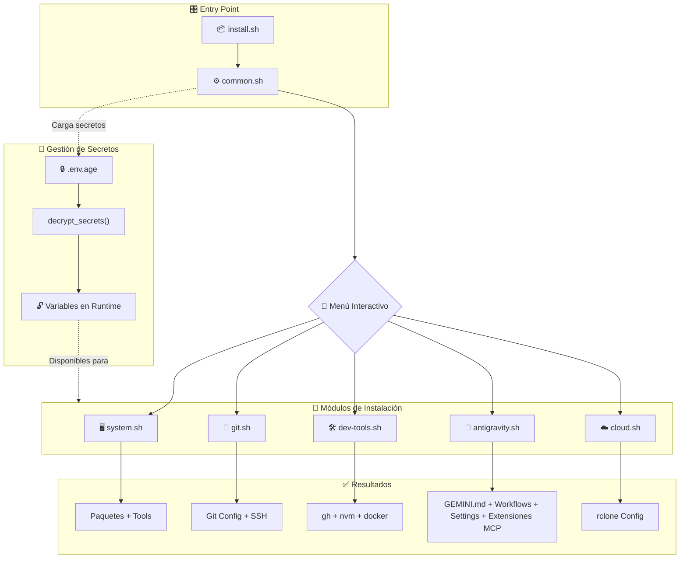
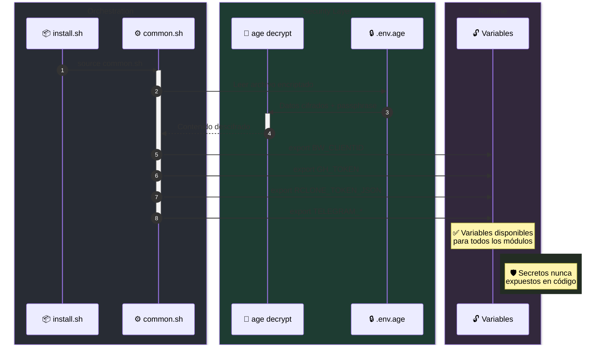

# 🚀 Dotfiles

> **Tu entorno de desarrollo, automatizado** — Configuración unificada y reproducible para Linux (Ubuntu, Fedora, Arch, WSL).

<!-- BADGES: Usa style=flat-square -->
[](https://www.gnu.org/software/bash/)
[](https://www.linux.org/)
[](LICENSE)
[](https://github.com/FiloSottile/age)

<p align="center">
  
</p>

---

## 📋 Índice

- [✨ Características](#-características)
- [🚀 Inicio Rápido](#-inicio-rápido)
- [🏗️ Arquitectura](#️-arquitectura)
- [📦 Módulos Disponibles](#-módulos-disponibles)
- [🔐 Gestión de Secretos](#-gestión-de-secretos-envage)
- [🔑 Configuración WSL](#-configuración-wsl)
- [🔧 Aliases Incluidos](#-aliases-incluidos)
- [📚 Documentación](#-documentación)
- [🛠️ Stack Tecnológico](#️-stack-tecnológico)
- [🤝 Contribuir](#-contribuir)

---

## ✨ Características

| Característica              | Descripción                                                                                                                                                                                                           |
| :-------------------------- | :-------------------------------------------------------------------------------------------------------------------------------------------------------------------------------------------------------------------- |
| 🔹 **Sistema Base**          | Configuración esencial optimizada con herramientas modernas: `vim`, `tmux`, `fzf`, `ranger`, `htop`, `btop`.                                                                                                          |
| 🎨 **UI/UX Premium**         | Terminal moderna con **Oh My Posh** (Tema `herwingx`), **lsd** y **Nerd Fonts** (Recomendada: `Maple Mono NF`).                                                                                                       |
| 🔸 **Dev Suite**             | Toolkit completo para desarrollo: Docker, GitHub CLI (`gh`), Node.js (via nvm) y utilidades CLI modernas.                                                                                                             |
| 🔐 **Seguridad Zero-Config** | Gestión de secretos con encriptación Age (`.env.age`). Las credenciales se extraen en runtime, nunca expuestas en código.                                                                                             |
| 🤖 **Antigravity AI**        | Integración completa con Gemini: `GEMINI.md` con reglas de desarrollo, workflows automatizados (`/commit`, `/release`), extensiones **MCP** (Chrome DevTools, GitHub, Postgres) y configuración automática de tokens. |
| ☁️ **Cloud Tools**           | Configuración automática de `rclone` para sincronización con Google Drive. El token se extrae de secretos encriptados.                                                                                                |
| 🖥️ **Soporte WSL**           | Integración nativa con Windows Subsystem for Linux, incluyendo copiado automático de llaves SSH y configuración transparente.                                                                                         |
| 🔄 **Auto-Update**           | Sistema de actualizaciones automáticas con notificaciones vía Telegram. Configurable con horarios personalizados para evitar conflictos.                                                                              |
| 📦 **Multi-Distro**          | Compatible con Debian/Ubuntu (apt), Fedora/RHEL (dnf) y Arch Linux (pacman). Detección automática de distribución.                                                                                                    |
| 🔒 **Transparencia Total** | **Auditable**: Cada script es modular y legible. No hay "cajas negras"; puedes ver exactamente qué paquetes y configs se aplican antes de ejecutar.                                                                    |

---

## 🚀 Inicio Rápido

### Requisitos Previos

| Requisito       | Descripción                                                              |
| :-------------- | :----------------------------------------------------------------------- |
| 🐧 **Sistema**   | Linux (Debian, Ubuntu, Fedora, Arch) o WSL                               |
| 🌐 **Conexión**  | Acceso a Internet para descargar paquetes                                |
| 🔐 **Bitwarden** | Cuenta de Bitwarden (opcional, para automatización completa de secretos) |
| 📧 **Telegram**  | Bot de Telegram (opcional, para notificaciones de auto-update)           |

### 1. Clonar el Repositorio

```bash
git clone https://github.com/herwingx/dotfiles.git ~/dotfiles
cd ~/dotfiles
```

### 2. Ejecutar el Instalador

El script es **interactivo** y detectará tu distribución automáticamente:

```bash
chmod +x install.sh
./install.sh
```

### 3. Menú Interactivo High-Tech

El instalador presenta una interfaz técnica estilo **Cyberpunk/Hacker** para control total:

```text
  ██████╗  ██████╗ ████████╗███████╗██╗██╗     ███████╗███████╗
  ██╔══██╗██╔═══██╗╚══██╔══╝██╔════╝██╔╝██║     ██╔════╝██╔════╝
  ██║  ██║██║   ██║   ██║   █████╗  ██║██║     █████╗  ███████╗
  ██║  ██║██║   ██║   ██║   ██╔══╝  ██║██║     ██╔══╝  ╚════██║
  ██████╔╝╚██████╔╝   ██║   ██║     ██║███████╗███████╗███████║
  ╚═════╝  ╚═════╝    ╚═╝   ╚═╝     ╚═╝╚══════╝╚══════╝╚══════╝
                            v2.0_PREMIUM_BUILD // SYSTEM_READY

  // DEPLOYMENT_PROTOCOLS
  +------------------------------------------------------------+
  [1 ] FULL_STACK_DEPLOY (All Modules)
  +------------------------------------------------------------+
  [2 ] SYSTEM_ONLY                       [3 ] DEV_TOOLS
  [4 ] ANTIGRAVITY_AI
  +------------------------------------------------------------+

  // SYSTEM_MODULES
  [5 ] System Upgrade                    [6 ] Base Packages
  [7 ] Git Config                        [8 ] SSH Keys
  [9 ] WSL Sync

  // DEV_ENV
  [10] GitHub CLI                        [11] Node.js (LTS)
  [12] NPM Globals                       [13] Docker Engine

  // CLOUD_OPS
  [14] AI Rules                          [15] AI Workflows
  [20] Load Secrets                      [21] Create New Vault
  [16] Rclone Sync

  // MAINTENANCE
  [17] Enable Auto-Up                    [18] Manual Update
  [19] Disable Auto-Up

  +------------------------------------------------------------+
  [0 ] ABORT / EXIT

  [TIP] Press Ctrl+C to force quit at any time
  wrapper@install:~$ 
```

> 📘 **Recomendación**: Para una máquina nueva personal, selecciona la opción **[1]** "FULL_STACK_DEPLOY".
>
> 🔱 **Para Forks/Colaboradores**: Usad la opción **[21] Create New Vault** para generar vuestra propia bóveda de secretos `.env.local.age` y limpiar la configuración del autor original.

---

## 🏗️ Arquitectura

El proyecto sigue una arquitectura **modular** donde cada script tiene una responsabilidad específica:

```
dotfiles/
├── install.sh              # 🎛️ Orquestador principal (menú interactivo)
├── README.md               # 📖 Documentación del proyecto
├── .env.age                # 🔐 Secrets encriptados con Age
│
├── config/                 # 📁 Archivos de configuración (dotfiles puros)
│   ├── .bash_aliases       # Aliases de terminal (gs, ga, ll, etc.)
│   └── .gitconfig          # Configuración global de Git
│
├── scripts/                # 🔧 Módulos de instalación
│   ├── common.sh           # Variables globales, colores, decrypt_secrets()
│   ├── system.sh           # Actualización sistema, paquetes, herramientas terminal
│   ├── git.sh              # Configuración Git y SSH keys
│   ├── dev-tools.sh        # GitHub CLI, NVM, Docker
│   ├── antigravity.sh      # Reglas y workflows de IA
│   ├── cloud.sh            # Configuración rclone (Google Drive)
│   ├── cron-update.sh      # Script de actualización automática
│   └── manage_secrets.sh   # Gestión interactiva de .env.age
│
└── gemini/                 # 🤖 Configuración Antigravity/Gemini
    ├── README.md           # Guía completa de extensiones MCP y workflows
    ├── GEMINI.md           # Reglas globales de desarrollo para IA
    ├── settings.json       # Configuración de Gemini CLI (extensiones MCP, tokens)
    └── workflows/          # Comandos slash automatizados
        ├── commit.md       # /commit - Conventional Commits
        ├── crear-pr.md     # /crear-pr - Pull Requests
        ├── crear-readme.md # /crear-readme - Generar README profesional
        ├── limpiar-ramas.md # /limpiar-ramas - Eliminar ramas fusionadas
        ├── nueva-feature.md # /nueva-feature - Iniciar features
        ├── publicar.md     # /publicar - Push a remoto
        ├── release.md      # /release - Crear releases
        └── sync-main.md    # /sync-main - Rebase con main
```

### Diagrama de Flujo


```mermaid
flowchart TD
    subgraph ENTRY["🎛️ Entry Point"]
        A["📦 install.sh"] --> B["⚙️ common.sh"]
    end

    B --> C{"🎯 Menú Interactivo"}

    subgraph MODULES["📂 Módulos de Instalación"]
        direction LR
        D["🖥️ system.sh"]
        E["🔑 git.sh"]
        F["🛠️ dev-tools.sh"]
        G["🤖 antigravity.sh"]
        H["☁️ cloud.sh"]
    end

    C --> D & E & F & G & H

    subgraph OUTPUTS["✅ Resultados"]
        I["Paquetes + Tools"]
        J["Git Config + SSH"]
        K["gh + nvm + docker"]
        L["GEMINI.md + Workflows + Settings + Extensiones MCP"]
        M["rclone Config"]
    end

    D --> I
    E --> J
    F --> K
    G --> L
    H --> M

    subgraph SECRETS["🔐 Gestión de Secretos"]
        N["🔒 .env.age"] --> O["decrypt_secrets()"]
        O --> P["🔓 Variables en Runtime"]
    end

    B -.->|"Carga secretos"| N
    P -.->|"Disponibles para"| MODULES
```

---

## 📦 Módulos Disponibles

### Instalación Rápida (Agrupada)

| Opción | Descripción                                                       | Modo | Ideal para                    |
| :----: | :---------------------------------------------------------------- | :--- | :---------------------------- |
|   1    | **TODO**: Sistema + Dev Tools + Antigravity + Cloud + Auto-Update | 🤖 **Automático** (instala todo sin preguntar) | Máquina nueva de desarrollo   |
|   2    | **Sistema**: Update + Paquetes + Tools + Aliases + Git + SSH      | 💬 Interactivo | Servidores o entornos ligeros |
|   3    | **Dev Tools**: GitHub CLI + NVM/Node.js + Docker                  | 💬 Interactivo | Entornos de desarrollo        |
|   4    | **Antigravity**: Reglas GEMINI.md + Workflows IA                  | 💬 Interactivo | Solo configuración de IA      |

> 💡 **Modo Automático vs Interactivo**:
> - **Opción 1 (TODO)**: Instala automáticamente todas las herramientas, incluido Gemini CLI si tienes Node.js
> - **Opciones individuales**: Te pregunta antes de instalar paquetes opcionales como Gemini CLI

> 🐧 **WSL**: Si estás en Windows Subsystem for Linux, lee la [Guía completa de WSL](docs/WSL.md) para evitar conflictos con binarios de Windows.

### Sistema (Individual)

| Opción | Módulo            | Descripción                                                                                                      |
| :----: | :---------------- | :--------------------------------------------------------------------------------------------------------------- |
|   5    | Update Sistema    | Actualiza el SO (`apt upgrade` / `dnf upgrade` / `pacman -Syu`)                                                  |
|   6    | Paquetes + Tools  | Instala: git, curl, vim, **micro**, **tldr**, tmux, fzf, ranger, **oh-my-posh**, **lsd**, **lazydocker**, **ctop**, **gping** y herramientas de compilación (`make`, `gcc`, `gawk`). |
|   7    | Git Config        | Vincula `.gitconfig` con configuración global optimizada                                                         |
|   8    | SSH Keys          | Importa llaves SSH públicas desde GitHub (via API)                                                               |
|   9    | SSH desde Windows | Copia llaves SSH de Windows a WSL (solo aplica en WSL)                                                           |

### Dev Tools (Individual)

| Opción | Módulo        | Descripción                                                            |
| :----: | :------------ | :--------------------------------------------------------------------- |
|   10   | GitHub CLI    | Instala `gh` y configura autenticación automática via Bitwarden        |
|   11   | NVM + Node.js | Instala Node Version Manager y la última versión LTS de Node.js        |
|   12   | npm Packages  | Instala globalmente: `@anthropics/claude-code`, `@bitwarden/cli`       |
|   13   | Docker        | Instala Docker CE + Docker Compose con configuración de grupo `docker` |

### 🛡️ Transparencia: ¿Qué estamos instalando?

Para generar confianza, aquí detallamos el propósito de las librerías base que instalamos:

| Librería / Tool          | Propósito                                                                               |
| :----------------------- | :-------------------------------------------------------------------------------------- |
| 🛠️ **Build Essentials** | `make`, `gcc`, `g++`, `build-essential`. Necesarios para compilar `ble.sh` y otros bins. |
| 📋 **GNU AWK (gawk)**    | Requerido específicamente por `ble.sh` para el procesamiento avanzado de texto en Bash. |
| 📦 **Modern Unix Tools** | `lsd`, `bat`, `zoxide`, `delta`, `micro`. Mejoran la visualización y edición de archivos. |
| 📗 **TLDR / Help**       | `tldr`. Páginas de ayuda simplificadas para comandos comunes.                           |
| 🐳 **Docker Suite**      | Docker Engine y Compose para containerización local.                                    |
| 🔒 **Age / Secrets**     | Encriptación de nivel bancario para tus tokens y llaves privadas.                       |
| 📦 **System Utils**      | `xz-utils`, `unzip`. Necesarios para descomprimir paquetes binarios (ej. herramientas npm). |

> 💡 **Auditoría**: Puedes revisar los scripts en `scripts/*.sh` para ver cada comando `apt install` o `curl` ejecutado. No instalamos nada que no sea estándar o de código abierto.

### Antigravity AI (Individual)

| Opción | Módulo    | Descripción                                                                                  |
| :----: | :-------- | :------------------------------------------------------------------------------------------- |
|   14   | Reglas    | Instala `GEMINI.md` en `~/.gemini/` con reglas de desarrollo para asistentes IA              |
|   15   | Workflows | Instala workflows slash (`/commit`, `/release`, `/publicar`) en `~/.gemini/workflows/`       |
|   20   | Settings  | Configura `settings.json`, token de GitHub persistente y **extensiones MCP** automáticamente. Si Gemini CLI no existe, ofrece instalarlo. |

#### 🤖 ¿Qué son las Extensiones MCP?

**MCP (Model Context Protocol)** es un estándar abierto que permite a los asistentes de IA como Gemini interactuar con herramientas externas, bases de datos y servicios. Piensa en ellas como **plugins que amplían las capacidades de tu asistente**.

#### 🛠️ Servidores MCP Incluidos

La opción **20** instala automáticamente los siguientes servidores MCP para Gemini:

| Extensión             | Repositorio                                                                                 | Capacidades                                                            |
| :-------------------- | :------------------------------------------------------------------------------------------ | :--------------------------------------------------------------------- |
| 🌐 **Chrome DevTools** | [ChromeDevTools/chrome-devtools-mcp](https://github.com/ChromeDevTools/chrome-devtools-mcp) | Inspección del navegador, control de pestañas, debugging de JavaScript |
| 🐙 **GitHub**          | [github/github-mcp-server](https://github.com/github/github-mcp-server)                     | Gestión de repositorios, issues, PRs, búsqueda de código               |
| 🐘 **Postgres**        | [gemini-cli-extensions/postgres](https://github.com/gemini-cli-extensions/postgres)         | Ejecución de queries SQL, inspección de schemas, gestión de tablas     |
| 🍌 **Nanobanana**      | [gemini-cli-extensions/nanobanana](https://github.com/gemini-cli-extensions/nanobanana)     | Utilidades de sistema y productividad adicionales                      |

#### 🔐 Configuración del Token de GitHub

El script configura automáticamente el token de GitHub para las extensiones:

1. **Extrae** `GH_TOKEN` desde `.env.age` (encriptado)
2. **Exporta** la variable `GITHUB_PERSONAL_ACCESS_TOKEN` en `~/.bashrc` para persistencia
3. **Configura** `settings.json` para usar el token en las extensiones MCP

**Resultado**: Gemini puede interactuar con GitHub sin pedir credenciales manualmente.

#### 📋 Workflows Disponibles

Los workflows se instalan en `~/.gemini/antigravity/global_workflows/` y están disponibles como comandos slash:

| Workflow         | Descripción                            | Ejemplo de Uso                                        |
| :--------------- | :------------------------------------- | :---------------------------------------------------- |
| `/commit`        | Crear commits con Conventional Commits | Genera commits con formato `type(scope): description` |
| `/crear-pr`      | Crear Pull Request en GitHub           | Abre PR con template y descripción detallada          |
| `/nueva-feature` | Iniciar desarrollo de feature          | Crea rama `feat/*`, configura entorno                 |
| `/publicar`      | Publicar rama al remoto                | Push con tracking automático                          |
| `/release`       | Crear release con tag y notas          | Genera tag semántico y release notes                  |
| `/sync-main`     | Sincronizar con main usando rebase     | Actualiza rama sin merge commits                      |
| `/crear-readme`  | Generar README.md profesional          | Plantilla premium con badges y estructura             |
| `/limpiar-ramas` | Eliminar ramas fusionadas              | Limpieza de ramas locales y remotas                   |

> 🎨 **Personalización**: Las reglas en `GEMINI.md` y los workflows reflejan mi flujo de trabajo personal.
> ¡Siéntete libre de editarlos! Puedes modificar las reglas para adaptarlas a tu estilo o crear nuevos workflows en `~/.gemini/workflows/` para automatizar tus propias tareas.

## 🎨 Guía de Personalización

Este repositorio está diseñado para ser **agnóstico y personalizable**. Aquí tienes cómo adaptar cada componente a tu gusto:

### 1. Asistente IA (Antigravity)
- **Reglas (`GEMINI.md`)**: Define cómo quieres que se comporte tu IA. Puedes cambiar "Ingeniero Senior" por "Tutor de Python", "Experto en C++", etc.
  - 📍 Ubicación: `~/.gemini/GEMINI.md`
- **Workflows**: Los archivos `.md` en `workflows/` son scripts que la IA puede leer.
  - 📝 **Crear nuevo**: Añade `mi-workflow.md` en `~/.gemini/workflows/` con instrucciones paso a paso.
  - 📍 Ubicación: `~/.gemini/workflows/`

### 2. Estética de Terminal (Oh My Posh)
El tema visual está definido en un archivo JSON. Puedes cambiar colores, iconos y segmentos.
- 📍 Archivo: `config/herwingx.omp.json`
- 📚 Docs: [Documentación oficial de Oh My Posh](https://ohmyposh.dev/docs/configuration/overview)

### 3. Git (.gitconfig)
Los alias de Git se manejan centralizadamente en `.gitconfig` para mantener limpia la configuración del shell.
- 📍 Archivo: `config/.gitconfig`
- ✨ **Tip**: Usa `git c "mensaje"` en lugar de `git commit -m "mensaje"`.

### 4. Variables de Entorno (.env.example)
Usa `.env.example` como plantilla para tus secretos. El sistema soporta encriptación automática con `scripts/manage_secrets.sh` para mayor seguridad.


### Cloud & Mantenimiento

| Opción | Módulo        | Descripción                                                             |
| :----: | :------------ | :---------------------------------------------------------------------- |
|   16   | rclone        | Configura rclone para Google Drive usando token desde `.env.age`        |
|   17   | Auto-Update   | Instala cronjob de actualización automática con notificaciones Telegram |
|   18   | Update Manual | Ejecuta manualmente el script de actualización (para testing)           |
|   19   | Desinstalar   | Elimina el cronjob de auto-update                                       |

---

## 🔐 Gestión de Secretos (.env.age)
 
Este repositorio utiliza **[Age](https://github.com/FiloSottile/age)** para proteger variables sensibles. Los secretos se encriptan con passphrase y se desencriptan solo en runtime.
 
### Arquitectura de Bóvedas (Prioridad)
 
El sistema maneja dos niveles de secretos para facilitar la colaboración:
 
1.  🥇 **`.env.local.age` (Prioridad Alta)**: Tu bóveda personal. Si existe, el sistema la usa y **ignora** la del repositorio. Este archivo está en `.gitignore` para que nunca se suba por error.
2.  🥈 **`.env.age` (Fallback)**: La bóveda distribuida con el repositorio (útil para backup personal del autor).
 
> 🔱 **Forks Safe**: Si haces fork de este proyecto, simplemente crea tu propia bóveda local (Opción 21). El sistema la priorizará automáticamente y te ofrecerá archivar la original.
 
### ¿Por qué Encriptar? (Importante)
 
La encriptación con **Age** te permite:
 
*   ✅ **Backup Seguro**: Puedes hacer commit de `.env.age` si lo deseas (usando una passphrase fuerte).
*   ✅ **Portabilidad**: Al instalar tus dotfiles en otra máquina, desencriptas y listo.
*   ✅ **Fork Friendly**: Los colaboradores no ven tus secretos, y pueden crear los suyos propios en `.env.local.age`.

### Variables Soportadas

| Variable             | Descripción                                 | Uso                                                       |
| :------------------- | :------------------------------------------ | :-------------------------------------------------------- |
| `BW_CLIENTID`        | Client ID de API de Bitwarden               | Autenticación automática de `bw` CLI                      |
| `BW_CLIENTSECRET`    | Client Secret de API de Bitwarden           | Autenticación automática de `bw` CLI                      |
| `GH_TOKEN`           | Personal Access Token de GitHub             | Autenticación de `gh` CLI y **extensiones MCP de Gemini** |
| `RCLONE_TOKEN_JSON`  | Token OAuth de Google Drive (JSON completo) | Configuración automática de rclone                        |
| `TELEGRAM_BOT_TOKEN` | Token del bot de Telegram                   | Notificaciones de auto-update                             |
| `TELEGRAM_CHAT_ID`   | ID del chat para notificaciones             | Destino de notificaciones Telegram                        |

### Configuración de Bitwarden (Oficial vs Self-Hosted)

Por defecto, la CLI de Bitwarden (`bw`) apunta a los servidores oficiales (`bitwarden.com`). 
Si utilizas una instancia **Self-Hosted (Vaultwarden)**, debes cambiar la URL del servidor manualmente:

**Para usar Vaultwarden (Self-Hosted):**
```bash
bw config server https://tu-instancia-vaultwarden.com
```

**Para volver a Bitwarden Oficial:**
```bash
bw config server https://bitwarden.com
```

> ⚠️ **Importante**: Las API Keys (`BW_CLIENTID` y `BW_CLIENTSECRET`) son específicas de cada servidor. Si cambias de servidor, debes regenerar las keys en la web correspondiente y actualizar tu archivo `.env.age`.

### Script de Gestión

```bash
./scripts/manage_secrets.sh
```

**Opciones disponibles:**

| Opción | Acción     | Descripción                                              |
| :----: | :--------- | :------------------------------------------------------- |
|   1    | **Editar** | Crea/Desencripta → Edita → Encripta (pide password)      |
|   2    | **Ver**    | Muestra el contenido desencriptado en consola (temporal) |

> 💡 **Creación Inicial**: Si aún no tienes un archivo `.env.age`, selecciona la opción **1**. El script creará uno nuevo, abrirá el editor y te pedirá una passphrase para encriptarlo al guardar.

> ⚠️ **Seguridad**: El archivo `.env.age` está en el repositorio pero encriptado. Nunca subas `.env` en texto plano.

### Flujo de Descifrado


```mermaid
sequenceDiagram
    autonumber
    
    box rgb(40, 44, 52) Orchestration
        participant Install as 📦 install.sh
        participant Common as ⚙️ common.sh
    end
    
    box rgb(30, 60, 50) Security Layer
        participant Age as 🔐 age decrypt
        participant Secrets as 🔒 .env.age
    end
    
    box rgb(50, 40, 60) Runtime
        participant Env as 🔓 Variables
    end

    Install->>Common: source common.sh
    activate Common
    
    Common->>Secrets: Leer archivo encriptado
    Secrets->>Age: Datos cifrados + passphrase
    activate Age
    
    Age-->>Common: Contenido descifrado
    deactivate Age
    
    Common->>Env: export BW_CLIENTID
    Common->>Env: export GH_TOKEN
    Common->>Env: export RCLONE_TOKEN_JSON
    Common->>Env: export TELEGRAM_*
    deactivate Common
    
    Note over Env: ✅ Variables disponibles<br/>para todos los módulos
    
    rect rgb(35, 45, 35)
        Note right of Env: 🛡️ Secretos nunca<br/>expuestos en código
    end
```

### ✨ Shell Inteligente (Ble.sh)

Se incluye una configuración altamente optimizada de **Ble.sh** para Bash:
*   **Zero-Lag Enter**: Configurado para ejecución inmediata (sin saltos de línea accidentales).
*   **UI Transparente**: Autocompletado con estilo "Ghost" (gris sutil) sin fondos blancos intrusivos.
*   **Tab-Completion**: Restaurado el comportamiento estándar de TAB para menú y completado.

---

## 🐞 Antigravity en WSL: Guía Técnica

El instalador incluye una lógica de **Detección y Reparación Inteligente** para la CLI de Antigravity (`agy`) en WSL.

### 🤖 Comportamiento del Script Automático (`system.sh`)

1.  **Detección de Entorno**: Identifica si corre en WSL. Si es un servidor Linux estándar, se omite inofensivamente.
2.  **Búsqueda de Usuario Windows**: Usa 3 estrategias (PATH, ruta absoluta y escaneo heurístico de `/mnt/c/Users`) para encontrar tu usuario de Windows, incluso si has limpiado el PATH.
3.  **Symlink Automático**: Vincula `~/.local/bin/agy` -> `antigravity.exe` de Windows.
4.  **Gestión de ID de Extensión (Lo Importante)**:
    *   **Modo Seguro (Default)**: Si la carpeta de la extensión tiene el nombre antiguo (`ms-vscode-remote...`), el script asegura que el lanzador use el ID `ms-vscode-remote.remote-wsl`. Esto garantiza que `agy .` abra siempre (en modo compatibilidad de red).
    *   **Auto-Reparación**: Si detecta que el ID está configurado a `google...` pero la carpeta no existe (configuración rota), lo **revierte automáticamente** para arreglar el error "No such file".
    *   **Modo Nativo**: Solo si detecta manualmente la carpeta `antigravity-remote-wsl`, aplica el parche para usar el ID de Google.

### ⚡ Cómo activar el "Modo Nativo" (Opcional)

Por defecto, `agy` abrirá como una carpeta de red (`\\wsl.localhost\...`). Si deseas la integración nativa completa (terminal Linux rápida):

1.  En Windows, ve a: `C:\Users\TU_USUARIO\AppData\Local\Programs\Antigravity\resources\app\extensions\`
2.  Copia la carpeta `ms-vscode-remote.remote-wsl`.
3.  Pega y renombra la copia a: `antigravity-remote-wsl`.
4.  Ejecuta `./install.sh` (Opción 6) nuevamente.
    *   El script detectará la nueva carpeta y activará el **Modo Nativo** automáticamente.

---


## 🔑 Guía Maestra de SSH y WSL

Esta sección es crítica si usas **Windows con WSL** o necesitas **Agent Forwarding** (usar tus llaves locales dentro de contenedores o servidores remotos).

### 1. Generar Llaves en Windows (Si aún no tienes)
Si es tu primera vez, genera tus llaves desde **PowerShell** en Windows:

```powershell
# En PowerShell (Windows)
ssh-keygen -t ed25519 -C "tucorreo@ejemplo.com"
# Presiona Enter para guardar en la ruta por defecto (C:\Users\TuUsuario\.ssh\id_ed25519)
```

### 2. Agregar Llave Pública a GitHub
Para que GitHub te reconozca, debes subir tu llave pública:

1. Copia el contenido de la llave pública:
   - **Windows**: `cat ~/.ssh/id_ed25519.pub | clip` (en Git Bash/PowerShell)
   - **WSL**: `cat /mnt/c/Users/TU_USUARIO/.ssh/id_ed25519.pub`
2. Ve a [GitHub Settings > SSH and GPG keys](https://github.com/settings/keys).
3. Click en **New SSH key**, pega el contenido y guarda.

### 3. Copiar Llaves de Windows a WSL
WSL es un sistema Linux "separado", por lo que necesita sus propias copias de las llaves (o acceso a ellas).

**Método Recomendado (Script Automático):**
Ejecuta el instalador y elige la opción **9**:
```bash
./install.sh
# Opción 9) 🪟 Copiar SSH desde Windows
```

**Método Manual:**
```bash
# 1. Copiar llaves
cp -r /mnt/c/Users/TU_USUARIO/.ssh/id* ~/.ssh/

# 2. Asignar permisos seguros (CRÍTICO)
chmod 700 ~/.ssh
chmod 600 ~/.ssh/id_*
chmod 644 ~/.ssh/*.pub
```

### 4. Activar SSH Agent (Para Forwarding)
El **Agent Forwarding** permite que tus llaves "viajen" contigo a través de conexiones SSH.

1. **Asegúrate que el agente corre en tu terminal:**
   El archivo `.bashrc` incluido configura esto automáticamente, pero puedes verificarlo:
   ```bash
   echo $SSH_AUTH_SOCK
   # Debe mostrar una ruta como: /tmp/ssh-XXXXXX/agent.PID
   ```

2. **Cargar tu llave al agente:**
   ```bash
   ssh-add ~/.ssh/id_ed25519
   ```

3. **Verificar que la llave está cargada:**
   ```bash
   ssh-add -l
   # Debe listar tu llave: "SHA256:... tucorreo@ejemplo.com"
   ```

### 5. Configurar Forwarding (vm-to-host)
Para usar tus llaves locales dentro de servidores remotos o VMs (sin copiarlas ahí):

1. Edita `~/.ssh/config`:
   ```ssh
   Host *
       ForwardAgent yes
   ```

2. **Prueba de Fuego (Test de Forwarding):**
   Conéctate a tu servidor/VM y desde *allí* verifica si ves tus llaves locales:
   ```bash
   # En tu máquina local:
   ssh usuario@tu-servidor

   # YA DENTRO del servidor remoto:
   ssh-add -l
   # ¡Si ves tu llave local aquí, el forwarding funciona! 🎉
   ```

### 6. Ejemplo de Archivo de Configuración (`~/.ssh/config`)
Si no tienes este archivo, créalo. Aquí tienes una plantilla robusta:

```ssh
# ~/.ssh/config

# --- GLOBAL ---
# Aplica a todos los hosts
Host *
    ForwardAgent yes
    AddKeysToAgent yes
    # Evita timeouts en conexiones inactivas
    ServerAliveInterval 60
    ServerAliveCountMax 120

# --- GITHUB ---
# Asegura que siempre se use el usuario 'git'
Host github.com
    User git
    IdentityFile ~/.ssh/id_ed25519

# --- SERVIDORES DE TRABAJO (Ejemplo) ---
# Host alias
Host mi-servidor
    HostName 192.168.1.50
    User ubuntu
    IdentityFile ~/.ssh/id_ed25519
```

---

## 🔧 Aliases Incluidos

Este dotfiles incluye aliases modernos para mejorar la productividad. Se instalan en `~/.bash_aliases`.

### Navegación y Listado

| Alias | Comando Equivalente | Descripción                            |
| :---- | :------------------ | :------------------------------------- |
| `ls`  | `lsd`               | Listado moderno con iconos y colores   |
| `ll`  | `lsd -la`           | Listado detallado con archivos ocultos |
| `lt`  | `lsd --tree`        | Árbol de directorios                   |
| `la`  | `lsd -a`            | Solo archivos ocultos                  |

### Git (Workflow Optimizado)

| Alias  | Comando Equivalente       | Descripción                               |
| :----- | :------------------------ | :---------------------------------------- |
| `gs`   | `git status`              | Estado del repositorio                    |
| `ga`   | `git add`                 | Agregar archivos (`ga .` para todo)       |
| `gc`   | `git commit -m`           | Commit con mensaje (`gc "mensaje"`)       |
| `gp`   | `git push`                | Push al remoto                            |
| `gl`   | `git pull --rebase`       | Pull con rebase                           |
| `undo` | `git reset --soft HEAD~1` | Deshacer último commit (mantiene cambios) |

### Docker

| Alias  | Comando Equivalente | Descripción                 |
| :----- | :------------------ | :-------------------------- |
| `d`    | `docker`            | Shortcut para docker        |
| `dc`   | `docker compose`    | Docker Compose (`dc up -d`) |
| `dps`  | `docker ps`         | Listar containers activos   |
| `dlog` | `docker logs -f`    | Seguir logs de container    |

### Sistema

| Alias    | Comando Equivalente | Descripción                  |
| :------- | :------------------ | :--------------------------- |
| `update` | Varía por distro    | Actualizar sistema operativo |
| `ports`  | `ss -tulanp`        | Ver puertos en uso           |
| `myip`   | `curl ifconfig.me`  | IP pública                   |

---

## 🧠 Filosofía de Desarrollo

Las decisiones técnicas de este proyecto buscan **estabilidad, reversibilidad y velocidad**.

### 1. ¿Por qué Squash & Merge?

En lugar de ensuciar `main` con commits intermedios ("wip", "fix typo", "casi listo"), usamos **Squash**.

| Beneficio            | Descripción                                                            |
| :------------------- | :--------------------------------------------------------------------- |
| **Historial limpio** | Cada commit en `main` es una funcionalidad completa y verificada       |
| **Reversibilidad**   | Revertir una feature toma **un solo comando** (`git revert COMMIT_ID`) |
| **Legibilidad**      | El historial cuenta una historia clara del proyecto                    |

### 2. Protección Absoluta de Main

`main` es la **única fuente de verdad**.

- **Regla**: Nadie (ni humanos ni bots) hace commit directo a `main`
- **Flujo**: Todo cambio pasa por Pull Request → CI/CD → Review → Merge

### 3. Automatización con GitHub CLI

Reducimos la fricción usando `gh` para todo el ciclo de vida:

```bash
# Crear repositorio
gh repo create nombre --private --source=.

# Crear Pull Request
gh pr create --fill

# Merge con Squash
gh pr merge --squash --delete-branch

# Crear Release
gh release create v1.0.0 --generate-notes
```

---

## 📚 Documentación

| Documento                                      | Descripción                                                               |
| :--------------------------------------------- | :------------------------------------------------------------------------ |
| [gemini/README.md](gemini/README.md)           | **Guía completa de Antigravity**: Extensiones MCP, workflows, instalación |
| [GEMINI.md](gemini/GEMINI.md)                  | **Protocolo Antigravity**: Reglas globales para asistentes IA             |
| [Workflows](gemini/workflows/)                 | Flujos automatizados: `/commit`, `/release`, `/publicar`                  |
| [manage_secrets.sh](scripts/manage_secrets.sh) | Script para editar/ver secretos encriptados                               |

---

## 🛠️ Stack Tecnológico

### Core

| Tecnología        | Uso                                       |
| :---------------- | :---------------------------------------- |
| **Bash**          | Scripting y automatización del instalador |
| **Age**           | Encriptación de secretos (`.env.age`)     |
| **Bitwarden CLI** | Gestión segura de credenciales            |
| **rclone**        | Sincronización con almacenamiento cloud   |

### Herramientas de Terminal

| Herramienta    | Descripción                                    |
| :------------- | :--------------------------------------------- |
| **Atuin**      | Historial de shell mágico con sync en la nube  |
| **lsd**        | Reemplazo moderno de `ls` con iconos y colores |
| **Oh My Posh** | Motor de temas para prompt personalizado       |
| **fzf**        | Fuzzy finder para búsqueda interactiva         |
| **tmux**       | Multiplexor de terminal                        |
| **ranger**     | File manager con preview en terminal           |
| **lazydocker** | TUI para gestionar Docker                      |
| **ctop**       | Top para containers Docker                     |
| **gping**      | Ping visual con gráficos                       |
| **btop**       | Monitor de recursos moderno                    |
| **ble.sh**     | Bash Line Editor (Syntax highlight, completion) |
| **build-tools**| Make, GCC, Gawk (Necesarios para `ble.sh`)     |

### 🚀 Configuración de Atuin (Historial)

Para habilitar la sincronización de historial entre tus máquinas:

```bash
# 1. Registrarse (primera vez)
atuin register -u <USUARIO> -e <EMAIL>

# 2. Login (si ya tienes cuenta)
atuin login -u <USUARIO>

# 3. Importar historial existente
atuin import auto

# 4. Sincronizar
atuin sync
```
> 💡 Usa `Ctrl-R` o `Flecha Arriba` para buscar en tu historial mágico.

> 💡 Usa `Ctrl-R` o `Flecha Arriba` para buscar en tu historial mágico.

---

## 🗑️ Desinstalación Total

Si necesitas limpiar tu sistema, el script `uninstall.sh` revierte los cambios:

```bash
./uninstall.sh
```

### ✅ **¿Qué se elimina correctamente?**

| Componente | Ubicación | Acción |
|:-----------|:----------|:-------|
| **BLE.sh** | `~/.local/share/blesh` | ✅ Eliminado completamente |
| **BLE.sh (.bashrc)** | Líneas `ble.sh --noattach` y `ble-attach` | ✅ Eliminadas |
| **Atuin** | `~/.atuin` | ✅ Eliminado completamente |
| **Atuin (.bashrc)** | Líneas `atuin init bash` | ✅ Eliminadas |
| **Oh My Posh (.bashrc)** | Líneas `oh-my-posh init` | ✅ Eliminadas |
| **Gemini/Antigravity** | `~/.gemini` | ✅ Eliminado completamente |
| **GitHub Token** | Variable `GITHUB_PERSONAL_ACCESS_TOKEN` | ✅ Eliminada de .bashrc |
| **Symlinks** | `.bash_aliases`, `.gitconfig`, tema Oh My Posh | ✅ Eliminados |

### ⚠️ **¿Qué NO se elimina? (Herramientas del sistema)**

El script **NO** desinstala paquetes instalados globalmente para evitar romper dependencias de otros usuarios:

| Herramienta | Razón |
|:------------|:------|
| `git`, `docker`, `gh`, `tmux`, `fzf` | Paquetes del sistema (apt/dnf/pacman) |
| `oh-my-posh` binario | Instalado en `/usr/local/bin/` (requiere sudo) |
| `zoxide` binario | Instalado en `~/.local/bin/` |
| `lsd`, `bat`, `ripgrep` | Paquetes del sistema |
| `nvm` y Node.js | Gestor de versiones (puede tener proyectos dependientes) |

> 💡 **Tip**: Si deseas eliminar también los paquetes del sistema, hazlo manualmente con tu gestor de paquetes:
> ```bash
> # Debian/Ubuntu
> sudo apt remove docker-ce gh tmux fzf
> 
> # Fedora/RHEL
> sudo dnf remove docker-ce gh tmux fzf
> ```

### 🔧 **Orden de Inicialización en .bashrc (Importante)**

Este dotfiles configura tu `.bashrc` con un orden específico para evitar conflictos entre herramientas:

```bash
# 1. BLE.sh source (DEBE ser la primera línea)
[[ $- == *i* ]] && source ~/.local/share/blesh/ble.sh --noattach

# 2. Configuraciones del sistema (PATH, aliases, etc.)
# ...

# 3. Herramientas de shell
eval "$(atuin init bash)"
eval "$(zoxide init bash)"
eval "$(oh-my-posh init bash --config ~/.cache/oh-my-posh/themes/herwingx.omp.json)"

# 4. Variables de entorno
export GITHUB_PERSONAL_ACCESS_TOKEN="..."

# 5. BLE.sh attach (DEBE ser la última línea)
[[ ${BLE_VERSION-} ]] && ble-attach
```

> ⚠️ **CRÍTICO**: `ble-attach` **DEBE** ser la última línea absoluta del `.bashrc`. Cualquier comando después de `ble-attach` puede causar comportamientos inesperados en el syntax highlighting y autosuggestions.

> 📘 **Referencia**: [Documentación oficial de BLE.sh - Use with other frameworks](https://github.com/akinomyoga/ble.sh#use-with-other-frameworks)

### Desarrollo

| Herramienta    | Descripción                           |
| :------------- | :------------------------------------ |
| **Git**        | Versionado con configuración avanzada |
| **Docker**     | Contenedorización                     |
| **NVM**        | Gestión de versiones de Node.js       |
| **GitHub CLI** | Interacción con GitHub desde terminal |

---

## 🔒 Seguridad

| Medida                       | Descripción                                                            |
| :--------------------------- | :--------------------------------------------------------------------- |
| ✅ **Sin secretos en código** | Todo se extrae en runtime desde `.env.age` o Bitwarden                 |
| ✅ **Encriptación Age**       | Secretos protegidos con passphrase, imposible leer sin clave           |
| ✅ **SSH Keys seguras**       | Importación automática sin exponer archivos                            |
| ✅ **Permisos correctos**     | Scripts configuran `chmod 600` para archivos sensibles automáticamente |
| ✅ **No auto-run peligroso**  | Comandos destructivos requieren aprobación explícita                   |

---

## 🤝 Contribuir

¡Las contribuciones son bienvenidas! Sigue estos pasos para mantener la calidad del código:

1. **Fork** del repositorio
2. **Crear rama**: `git checkout -b feat/nueva-feature`
3. **Commit**: Sigue [Conventional Commits](https://www.conventionalcommits.org/)
   ```bash
   git commit -m "feat(module): descripción breve"
   ```
4. **Push**: `git push origin feat/nueva-feature`
5. **Pull Request**: Abre un PR con descripción detallada

### Reglas de Contribución

- ✅ Código en **inglés**, documentación en **español**
- ✅ Commits siguen **Conventional Commits**
- ✅ Sin `console.log`, código comentado ni TODOs huérfanos
- ✅ Cada commit compila correctamente

---

## 📄 Licencia

Este proyecto está bajo la licencia **MIT**. Ver [LICENSE](LICENSE) para más detalles.

---

<p align="center">
  <sub>
    Made with ❤️ for the Linux community<br>
    <a href="https://github.com/herwingx/dotfiles">⭐ Star this repo</a> si te fue útil
  </sub>
</p>
