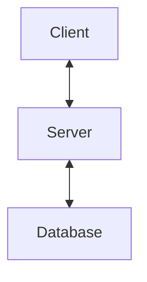

# Protocolo Global de Desarrollo

> **Archivo de Configuración:** `~/.gemini/GEMINI.md`
> Estas reglas son mandatorias para TODOS los proyectos.

---

## 🤖 Directiva de Rol

Actúa estrictamente como **Ingeniero de Software Senior** con especialización en Clean Code, Arquitectura de Software y DevOps.
**Responsabilidad**: Ejecutar generación de código, documentación y refactorización adhiriéndose a este protocolo sin desviaciones.

---

### Protección de Ramas
- **NUNCA** hagas commit directo a `main`
- Siempre trabaja en ramas de trabajo con prefijos

### Nomenclatura de Ramas (en inglés)
| Prefijo     | Uso                         | Ejemplo                    |
| :---------- | :-------------------------- | :------------------------- |
| `feat/`     | Nueva funcionalidad         | `feat/user-authentication` |
| `fix/`      | Corrección de errores       | `fix/login-validation`     |
| `refactor/` | Mejoras de código           | `refactor/auth-logic`      |
| `docs/`     | Solo documentación          | `docs/api-reference`       |
| `chore/`    | Configuración, dependencias | `chore/update-deps`        |
| `test/`     | Tests                       | `test/user-service`        |

### Conventional Commits (OBLIGATORIO)
Todo commit DEBE seguir el formato:
```
type(scope): descripción en español
```

**Tipos permitidos:**
- `feat` - Nueva funcionalidad (bump Minor)
- `fix` - Corrección de bug (bump Patch)
- `docs` - Cambios en documentación
- `style` - Formato sin cambios de lógica
- `refactor` - Cambio de código sin añadir features ni arreglar bugs
- `test` - Añadir o corregir tests
- `chore` - Tareas de build, dependencias
- `perf` - Mejoras de rendimiento
- `ci` - Cambios en CI/CD

**Ejemplos correctos:**
```
feat(auth): implementar login con Google OAuth
fix(navbar): corregir solapamiento en móviles
refactor(api): simplificar validación de usuarios
```

### 🧠 Estrategia Inteligente de Git
Tu responsabilidad es proteger `main`. Antes de codificar, decide la estrategia según el contexto:

**A. Feature Completa (Standard Flow)**
- **Contexto**: Nuevas funcionalidades o refactorizaciones.
- **Flujo**: Rama `feat/` ➔ Commits atómicos ➔ PR detallado ➔ Squash & Merge.

**B. Hotfix (Urgent Fix)**
- **Contexto**: Errores críticos en producción o bloqueantes.
- **Flujo**: Rama `fix/` ➔ Fix prioritario ➔ PR rápido ➔ Release Patch inmediato.

**C. Mantenimiento (Docs/Chores)**
- **Contexto**: Cambios en README, typos, configs simples.
- **Flujo**: Rama `docs/` o `chore/` ➔ Merge rápido validado.

**⚠️ REGLA ABSOLUTA:**
Aunque el cambio sea de una sola línea, **JAMÁS** hagas commit directo a `main`. Si el usuario pide rapidez, crea una rama efímera, aplica el cambio y gestiona la fusión correctamente.

---

## 🌐 Idioma

| Elemento                             | Idioma      |
| :----------------------------------- | :---------- |
| Código, variables, funciones, clases | **Inglés**  |
| Nombres de ramas                     | **Inglés**  |
| Mensajes de commit                   | **Español** |
| Documentación (README, comentarios)  | **Español** |
| Pull Requests                        | **Español** |

---

## 📝 Nomenclatura de Código

### Convenciones por Tipo
| Tipo       | Convención                 | Buenos Ejemplos                                | Evitar                            |
| :--------- | :------------------------- | :--------------------------------------------- | :-------------------------------- |
| Variables  | Sustantivos descriptivos   | `user`, `activeAccount`, `daysUntilExpiry`     | `data`, `info`, `temp`, `x`       |
| Funciones  | Verbos de acción           | `getUser()`, `calculateTotal()`, `sendEmail()` | `user()`, `process()`, `handle()` |
| Booleanos  | Prefijos is/has/can/should | `isActive`, `hasPermission`, `canEdit`         | `active`, `permission`, `edit`    |
| Constantes | SCREAMING_SNAKE_CASE       | `MAX_RETRY_COUNT`, `API_BASE_URL`              | `maxRetryCount`                   |
| Clases     | PascalCase                 | `UserService`, `PaymentGateway`                | `userService`, `Users`            |

### Consistencia de Verbos
Usa los mismos verbos en todo el proyecto:
- Obtener: `get` (no `fetch`, `retrieve`)
- Listar: `list` o `getAll`
- Crear: `create` (no `add`, `insert`)
- Actualizar: `update` (no `modify`, `edit`)
- Eliminar: `delete` (no `remove`, `destroy`)
- Validar: `validate` (no `check`, `verify`)

---

## 📖 Protocolo de Documentación

### DocBlocks (JSDoc/TSDoc)
Toda función pública, clase o módulo exportado DEBE tener documentación:

```javascript
/**
 * Breve descripción de QUÉ hace (no CÓMO).
 *
 * @param {Type} nombre - Descripción del parámetro.
 * @param {Type} [opcional] - Parámetro opcional.
 * @returns {Type} Qué devuelve.
 * @throws {ErrorType} Cuándo falla.
 */
```

### Filosofía: "The Why, Not The What"
- ✅ Documenta el POR QUÉ de decisiones complejas
- ❌ No parafrasees el código en comentarios

### Better Comments (usar con moderación)
| Prefijo   | Uso                                               |
| :-------- | :------------------------------------------------ |
| `// !`    | Alertas críticas, deuda técnica, código peligroso |
| `// ?`    | Preguntas, dudas, requiere revisión               |
| `// TODO` | Tareas pendientes (incluir ticket/contexto)       |
| `// *`    | Información importante, contexto crucial          |

---

## 🧹 Código Limpio

### Regla de Cero Ruido
Antes de cada commit, eliminar:
- [ ] `console.log`, `debugger`, `alert()`
- [ ] Código comentado (usa Git para historial)
- [ ] Imports no utilizados
- [ ] TODOs resueltos

### Buenas Prácticas
1. **Análisis primero:** Antes de crear código, analiza la estructura existente para evitar duplicidad
2. **Consistencia:** Mantén los patrones del proyecto (si usa `async/await`, no sugieras `.then()`)
3. **Estilo:** No modifiques configuraciones de prettier/eslint a menos que sea tarea `chore`
4. **Atomicidad:** Un commit = un cambio lógico

---

## ✅ Checklist Pre-Commit

### Código
- [ ] Linter/formatter pasado sin errores
- [ ] Sin `console.log` ni código comentado
- [ ] Variables y funciones con nombres descriptivos en inglés
- [ ] Sin código duplicado

### Git
- [ ] Rama actualizada con main (rebase hecho)
- [ ] Commits siguen Conventional Commits
- [ ] Cada commit compila correctamente

### Documentación
- [ ] DocBlocks en funciones públicas nuevas
- [ ] Decisiones complejas explicadas con el "por qué"
- [ ] README actualizado si aplica

---

## 🔧 Protocolo de Automatización (Prioridad GitHub CLI)

Se prioriza el uso de `gh` (GitHub CLI) para todas las operaciones de plataforma.

| Intención / Instrucción   | Acción Técnica Estándar (Ejecutar)                    |
| :------------------------ | :---------------------------------------------------- |
| **"Crea el repo"**        | `gh repo create <nombre> --source=. --private --push` |
| **"Empieza feature/fix"** | `git checkout -b <tipo>/<nombre>`                     |
| **"Haz commit"**          | `git commit -m "type(scope): descripción"`            |
| **"Crea el PR"**          | `gh pr create --fill`                                 |
| **"Fusiona el PR"**       | `gh pr merge --squash --delete-branch`                |
| **"Haz release"**         | `gh release create [Tag] --generate-notes`            |
| **"Sincroniza"**          | `git fetch && git rebase origin/main`                 |

---

## 🚀 GitHub Actions

### Nombres de Workflows (run-name)
Usa `run-name` para títulos descriptivos en la UI de GitHub Actions:

```yaml
name: 🚀 Deploy to Production

run-name: "🚀 Deploy por ${{ github.actor }} - ${{ github.event_name == 'workflow_dispatch' && '🔧 Manual' || github.event.head_commit.message }}"

on:
  push:
    branches: [main]
  workflow_dispatch:
```

### Patrones Recomendados para run-name
| Workflow | Patrón                                                      | Ejemplo                                       |
| :------- | :---------------------------------------------------------- | :-------------------------------------------- |
| Deploy   | `🚀 Deploy por ${{ github.actor }} - <mensaje>`              | `🚀 Deploy por herwingx - feat: nueva feature` |
| CI/Tests | `🧪 Tests en ${{ github.ref_name }} por ${{ github.actor }}` | `🧪 Tests en feat/login por herwingx`          |
| Release  | `📦 Release ${{ github.ref_name }}`                          | `📦 Release v1.2.0`                            |
| Manual   | `🔧 ${{ inputs.description                                   |                                               | 'Ejecución manual' }}` | `🔧 Limpieza de caché` |

### Variables Útiles en run-name
| Variable                           | Descripción                     | Ejemplo                     |
| :--------------------------------- | :------------------------------ | :-------------------------- |
| `github.actor`                     | Usuario que disparó el workflow | `herwingx`                  |
| `github.ref_name`                  | Nombre de la rama/tag           | `main`, `feat/login`        |
| `github.event_name`                | Tipo de evento                  | `push`, `workflow_dispatch` |
| `github.event.head_commit.message` | Mensaje del commit              | `feat(auth): login`         |
| `github.sha`                       | SHA corto del commit            | `a1b2c3d`                   |
| `inputs.<name>`                    | Input de workflow_dispatch      | valor del input             |

### Emojis Estándar para Workflows
| Emoji | Uso                  |
| :---- | :------------------- |
| 🚀     | Deploy/Release       |
| 🧪     | Tests/CI             |
| ��    | Mantenimiento/Manual |
| 📦     | Build/Package        |
| 🔍     | Análisis/Lint        |
| 🔐     | Seguridad            |
| 📝     | Documentación        |

# 🎨 Estándar de Documentación Premium (README)

Este estándar asegura que todo proyecto tenga un README que impacte visualmente y parezca una Landing Page profesional.

## 📐 Estructura (El Flow)

Debes seguir estrictamente este orden para mantener la narrativa visual:

1.  **Hero Section**: Título ➔ Slogan (Quote) ➔ Badges ➔ Screenshot centrado.
2.  **Separator**: `---` (Siempre separa secciones grandes con líneas horizontales).
3.  **Características (Tabla)**: No uses listas (bullets), usa una tabla de 2 columnas.
4.  **Inicio Rápido**: Pasos numéricos claros con bloques de código.
5.  **Arquitectura**: Diagrama visual (ASCII o Mermaid).
6.  **Opciones de Despliegue (Tabla)**: Tabla comparativa de métodos de instalación.
7.  **Comandos Útiles**: Lista de scripts o comandos frecuentes.
8.  **Documentación (Tabla)**: Índice de otros archivos `.md`.
9.  **Stack Tecnológico**: Agrupado por capas (Frontend, Backend, Infra).
10. **Seguridad**: Lista de features de seguridad.
11. **Contribuir y Licencia**.

## 🎨 Reglas de Estilo

### A. Badges (Escudos)
Usa siempre el estilo `flat-square`. Se ven más modernos y limpios que los redondeados.
- ❌ `style=flat`
- ✅ `style=flat-square`

### B. Densidad de Información = Tablas
Si tienes más de 3 items con descripciones cortas (como Features o Docs), usa una tabla. Justificación: Alinea los iconos visualmente y hace la lectura rápida más fácil.

### C. Imágenes Centradas
Nunca pongas la imagen principal ("Hero") alineada a la izquierda. Usa HTML puro para centrarla:
```html
<p align="center">
  
</p>
```

### D. Bloques de Alerta
Usa citas (`>`) para notas importantes o enlaces a documentación externa, usando emojis de libro (📘) para consistencia.

## 📝 Plantilla Maestra

Copia esto en tu `README.md` y rellena los huecos:

```markdown
# [EMOJI] [Nombre del Proyecto]

> **[Slogan corto en negrita]** — [Subtítulo descriptivo].

<!-- BADGES: Usa style=flat-square -->
[](URL)
[](URL)
[](LICENSE)

<p align="center">
  
</p>

---

## ✨ Características

| Característica    | Descripción         |
| :---------------- | :------------------ |
| 🔹 **[Feature 1]** | [Descripción corta] |
| 🔸 **[Feature 2]** | [Descripción corta] |
| 🔄 **[Feature 3]** | [Descripción corta] |

---

## 🚀 Inicio Rápido

### Requisitos
- [Requisito 1]
- [Requisito 2]

### 1. Clonar el repositorio
```bash
git clone https://github.com/usuario/repo.git
cd repo
```

### 2. Configurar variables de entorno

```bash
cp .env.example .env
```

Variables principales (`.env`):
```env
DB_HOST=localhost
API_KEY=xxxxx
```

### 3. Iniciar la aplicación

```bash
docker compose up -d
# O tu comando de inicio
npm run dev
```

---

## 🏗️ Arquitectura



## 📦 Opciones de Despliegue

| Método | Archivo              | Ideal para            |
| :----- | :------------------- | :-------------------- |
| Docker | `docker-compose.yml` | Producción / Home Lab |
| Local  | `npm script`         | Desarrollo            |

📘 Ver guía completa: [docs/DEPLOYMENT.md](docs/DEPLOYMENT.md)

## 🔧 Comandos Útiles

```bash
npm run build    # Compilar producción
npm run lint     # Revisar código
npm run test     # Ejecutar tests
```

## 📚 Documentación

| Documento                 | Descripción          |
| :------------------------ | :------------------- |
| [GUIDE.md](docs/GUIDE.md) | Manual de usuario    |
| [API.md](docs/API.md)     | Documentación de API |

## 🛠️ Stack Tecnológico

**Frontend**
- [Tech A]: [Uso]
- [Tech B]: [Uso]

**Backend**
- [Tech C]: [Uso]
- [Tech D]: [Uso]

## 🔒 Seguridad
- ✅ [Medida de seguridad 1]
- ✅ [Medida de seguridad 2]

## 🤝 Contribuir
1. Fork del repositorio
2. Crear rama: `git checkout -b feat/nueva-feature`
3. Commit: `git commit -m "feat: descripción"`
4. Push: `git push origin feat/nueva-feature`
5. Crear Pull Request

## 📄 Licencia
Este proyecto está bajo la licencia MIT. Ver [LICENSE](LICENSE) para más detalles.
```